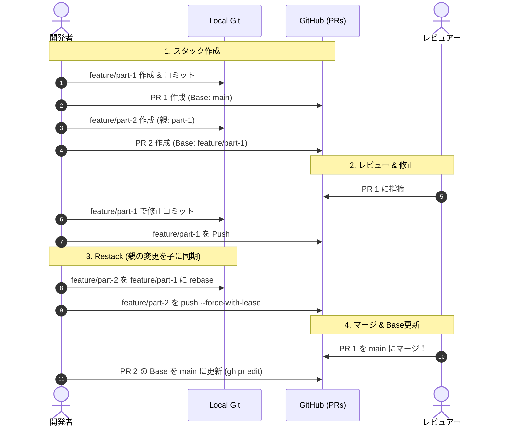

# Stacked PR (スタックドPR) 運用・実践ガイド

Stacked PR（積み上げ型PR）は、大規模な機能開発や段階的なリファクタリングにおいて、巨大なPull Request（PR）を作らずに **小さく独立してレビュー可能な一連のPRを連鎖状に積み上げる** 開発手法です。

---

## 1. Stacked PR の基本構造

```
main ─────► [PR 1: 基盤・モデル定義] ─────► [PR 2: API実装] ─────► [PR 3: UI・テスト]
 (Base: main)                  (Base: PR 1)                  (Base: PR 2)
```

- **PR 1**: `feature/part-1`（Base: `main`）
- **PR 2**: `feature/part-2`（Base: `feature/part-1`）
- **PR 3**: `feature/part-3`（Base: `feature/part-2`）

### 💡 なぜ Stacked PR を使うのか？
1. **レビュー負荷の劇的軽減**: レビュアーは数百行〜数千行の巨大PRではなく、100〜300行程度の集中したPRを1つずつレビューできます。
2. **ブロッキングの排除**: PR 1のレビューを待つ間に、その差分を前提とした PR 2, PR 3 の開発を止まらずに進められます。
3. **バグの局所化・安全なロールバック**: 各PRが独立した単位のため、問題発生時の切り戻しが容易です。

---

## 2. ライフサイクル・運用フロー



---

## 3. 具体的なコマンド操作

### ① 子ブランチの作成とPR作成
```bash
# 1. 親ブランチから子ブランチを作成
git checkout -b feature/part-2 feature/part-1

# 2. 実装 & コミット
git add . && git commit -m "feat: implement part 2"
git push -u origin feature/part-2

# 3. 親ブランチを --base に指定して PR 作成
gh pr create --base feature/part-1 --head feature/part-2 --title "feat: part 2 (Stacked on #1)"
```

---

### ② 親ブランチが更新されたときの追従（Restack / Rebase）
親ブランチ（`feature/part-1`）にレビュー指摘修正やコミットが追加された場合、子ブランチ（`feature/part-2`）を親の最新状態に追従させます。

```bash
# 1. 親ブランチの最新を取得
git checkout feature/part-1
git pull origin feature/part-1

# 2. 子ブランチに切り替えて rebase
git checkout feature/part-2
git rebase feature/part-1

# 3. 子ブランチを強制プッシュ（安全のため --force-with-lease を使用）
git push --force-with-lease origin feature/part-2
```

> [!TIP]
> もし親ブランチが `git commit --amend` や `git rebase -i` でコミットハッシュが変わっている場合は、`git rebase --onto` を使用します:
> ```bash
> git rebase --onto feature/part-1 <古い親のコミットハッシュ> feature/part-2
> ```

---

### ③ 親PRが `main` にマージされた後の Base 更新
PR 1 が `main` にマージされたら、PR 2 のベースブランチを `main` に切り替えます。

```bash
# 1. GitHub 上の PR 2 の base を main に更新
gh pr edit <PR2_NUMBER> --base main

# 2. ローカルの main を最新化して子ブランチを rebase
git checkout main
git pull origin main
git checkout feature/part-2
git rebase main
git push --force-with-lease origin feature/part-2
```

---

## 4. PR本文への Stack Navigation（スタック案内）の記載

レビュアーがスタック全体の文脈を把握できるよう、PR本文に以下のようなナビゲーションを記載するのがベストプラクティスです。

```markdown
## 🥞 Stacked PR
- ◀️ 親PR: #1 (基盤モデルの定義)
- 👉 **本PR: #2 (APIエンドポイント実装)**
- ▶️ 子PR: #3 (UI・E2Eテスト)
```
