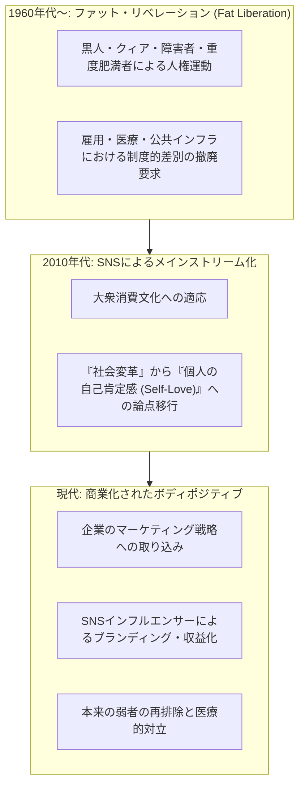
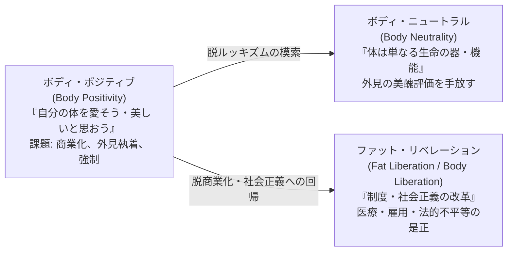

# ボディポジティブ運動の悪用と変質に関する調査報告

## 概要

ボディポジティブ運動（Body Positivity Movement）は、社会に定着した画一的な美の基準（痩身至上主義、若さへの過度な執着など）から人々を解放し、あらゆる体型・容姿の尊厳を認め合うことを目指して普及しました。

しかし、運動がSNSを通じて世界的なメインストリームとなる過程で、**「商業的な搾取（ウォッシング）」「インフルエンサーの収益化と欺瞞」「医学的知見の軽視・言論封殺」「本来の社会的弱者の再排除」「外見執着の温存（Toxic Positivity）」**といった深刻な変質や悪用が指摘されています。

本ドキュメントでは、ボディポジティブ運動が直面している構造的な問題点と悪用の実態を多角的に整理・分析します。

---

## 1. 歴史的ルーツと「脱政治化」のプロセス

ボディポジティブの変質を理解する上で、その起源と現代の姿の落差を把握することが不可欠です。

### 1.1 ファット・リベレーション運動（起源）
- 1960年代後半から1970年代にかけて、公民権運動やフェミニズム運動の文脈から生まれた「ファット・リベレーション（肥満解放運動）」が原型です。
- 主体となったのは、黒人女性、クィア、障害者、重度肥満者など、複合的な差別にさらされていた人々でした。
- 主な目的は、医療現場における不当な扱い、雇用・賃金差別、公共交通機関や座席などのインフラ排除を是正する**制度的・法的な社会正義運動**でした。

### 1.2 現代のボディポジティブ（脱政治化）
- 2010年代以降、InstagramなどのSNSの台頭とともに「ボディポジティブ」として急速に拡散しました。
- この過程で、社会構造や制度への変革要求が抜け落ち、「ありのままの自分を愛そう（Love Yourself）」という**個人の心理的・内面的なセルフラブ（自己愛）のスローガンへと脱政治化**されました。

---

## 2. 企業の商業的搾取（ウォッシングと消費主義への包摂）

運動の脱政治化により、ファッションや美容などの巨大産業が運動を「都合の良いマーケティングツール」として利用する道が開かれました。

### 2.1 パープルウォッシング／フェムウォッシング
- アパレルや化粧品メーカーが、多様な体型や肌の色のモデルを広告に起用することで、「先進的でインクルーシブなブランド」というイメージを獲得する手法です。
- しかし、実態としては以下のような矛盾が散見されます。
  - **サイズ展開の欠如**: 広告キャンペーンではプラスサイズモデルを全面に出す一方、実店舗や主要ラインナップではXL以上のサイズを扱わない、あるいはオンライン限定・高価格設定にする。
  - **サプライチェーンの不透明さ**: 多様性を謳う一方で、発展途上国の縫製労働者に対する低賃金・劣悪な労働環境の強要や、環境負荷の高い大量生産（ウルトラファストファッション）を放置する。

### 2.2 自己肯定感の「消費財化」
- 「このブランドの下着を身につければ自己肯定感が高まる」「このコスメを使えばありのままの自分に自信が持てる」というロジックで、本来は自己受容のための思想が「商品の購入を正当化する動機」にすり替えられました。
- 代表的な例として、補正下着（シェイプウェア）ブランドが「ボディポジティブ」を掲げながら、実際には体型を締め付けて整える商品を販売している矛盾が批判を浴びています。

### 2.3 トレンドとしての消費と「痩身回帰」
- 企業にとってボディポジティブは理念ではなく「売れるトレンド」に過ぎなかったことが、近年の動向で浮き彫りになりました。
- GLP-1受容体作動薬（オゼンピック等）の普及やY2Kファッション（超細身トレンド）の再燃に伴い、欧米の主要ラグジュアリーブランドやファッションウィークでは、プラスサイズモデルの起用が急速に削減され、極端な痩身モデルへの回帰が進んでいます。
- 市場の利益率が落ちると即座に多様性を切り捨てる姿勢は、企業の包括性が表層的であったことを示しています。

---

## 3. インフルエンサー文化における欺瞞と過激化

SNS上では、ボディポジティブが個人のアテンション獲得や収益化の手段として悪用されています。

### 3.1 「自己受容」のブランディングと密かな医療痩身
- 「ありのままの体を愛そう」と発信し、体型に悩むフォロワーから共感と支持を集めて巨大なインフルエンサービジネスを構築した人物が、裏でGLP-1受容体作動薬（オゼンピック、マンジャロ等）を用いて急激に減量する事例が多発しています。
- 減量自体は個人の自由であるものの、以下のような点がコミュニティからの強い反発を招いています。
  - 体型肯定を売りにした有料コミュニティや商品の販売で利益を得ていたこと。
  - 薬物による減量を隠蔽し、「生活習慣の改善」や「自然な変化」と偽って情報発信を行う欺瞞性。

### 3.2 コンプレックスの二重搾取
- 「ありのままを受け入れよう」と語りかける同一のアカウントで、ウエストを細く見せる補正下着、痩身サプリ、むくみ解消グッズなどのアフィリエイト広告や自社プロデュース商品を販売する構図が存在します。
- フォロワーの不安に寄り添うポーズを取りながら、最終的には不安を煽って商品を購買させる手法は、従来のダイエット産業の手法を踏襲しています。

### 3.3 過食・健康破壊のコンテンツ化
- 一部の配信者・インフルエンサーにおいて、「自分の欲求に正直になる」「食事制限からの解放」という言説を口実に、病的な大食い（極端なモッパン）や急激な体重増加をドラマ仕立てで配信し、視聴回数と広告収入を稼ぐ現象が見られます。
- これに対する健康面の懸念や批判に対して「体型差別（ファットフォビア）」というラベルを貼って反論し、健康被害が深刻化するまで過激化を止められない構造が指摘されています。

---

## 4. 医療・健康リスクの軽視と反科学的言説

運動の一部が先鋭化・歪曲された結果、医学的知見や公衆衛生の助言に対する敵対的な態度が生じています。

### 4.1 医学的指摘への「ファットフォビア」ラベリング
- 重度の肥満に伴う生活習慣病（2型糖尿病、高血圧、脂質異常症、虚血性心疾患、睡眠時無呼吸症候群、変形性関節症など）のリスクについて、医師や研究者が客観的なデータを提示した場合でも、「太っている人を差別している」「ファットフォビアだ」として攻撃・非難する言説が存在します。
- これにより、必要な医療介入や生活習慣の改善指導が躊躇されるなど、医療従事者と患者の適切なコミュニケーションが阻害されるリスクが生じています。

### 4.2 HAES（Health at Every Size）理念の曲解
- 本来のHAESは、「体重の数値そのものを唯一の健康指標とするのではなく、どのような体格であっても健康的な生活習慣（バランスの良い食事、適度な運動、メンタルケア）を実践することが重要である」という公衆衛生の提言です。
- しかし、これが一部で「どんな食生活や生活習慣を送ってどれほど肥満が進行しても、健康には全く影響がない」「肥満と病気の因果関係は存在しない」という**非科学的な現実逃避の論理**として曲解・悪用されるケースが発生しています。

---

## 5. 本来の弱者の再排除と「許容される太さ」の選別

メインストリーム化したボディポジティブは、メディアや大衆にとって「見栄えの良い多様性」のみを選択的に受容し、最も困難な立場にある人々を再び不可視化しています。

| 属性 | 現代のボディポジティブにおける扱い | 本来のファット・リベレーションの視点 |
| :--- | :--- | :--- |
| **体型の選別** | ウエストがくびれ、胸やヒップが大きい「砂時計体型（Curvy）」が偏重される。腹部や顔に脂肪がつく体型は依然として敬遠される。 | 体型や脂肪のつき方にかかわらず、すべての身体が平等な尊厳と権利を持つ。 |
| **容姿・人種** | 肌が整っており、顔立ちが端正な白人モデルが中心。 | 黒人女性、有色人種、先住民など、人種差別と体型差別が複合する当事者が起点。 |
| **健康・障害** | 健常者（エイブルボディ）であることが暗黙の前提。 | 慢性疾患や障害を抱える身体、自立困難な身体も含めた解放を目指す。 |
| **肥満度** | 軽度〜中度のふくよかさ（Plus Size）までが許容範囲。 | 超重度肥満者（Infini-fat等）が直面する公共スペースや医療機器の規格外問題を重視。 |

このように、商業化された運動は「社会的に許容できる範囲の美しさ」を少し拡張したに過ぎず、真の包摂からは遠ざかっているという批判が根強く存在します。

---

## 6. 有害なポジティブ（Toxic Positivity）とルッキズムの温存

精神面においても、「ポジティブでいなければならない」という教条主義が新たな心理的苦痛をもたらしています。

### 6.1 「自分の体を愛さなければならない」という強制
- 身体の痛み、疾患、急激な体型変化（妊娠・出産、加齢、病気治療による浮腫や体重変動など）に直面している人に対して、「それでも自分の体を美しいと誇るべきだ」というメッセージを押し付けることは、現実の苦しみを無視した精神的暴力（Toxic Positivity）になり得ます。
- 自分の体に違和感や不満を抱くこと自体を「意識が低い」「自己肯定感が足りない」と自己否定させる二次被害が生じています。

### 6.2 ルッキズム（外見至上主義）の枠組みの温存
- 「すべての体は美しい（All bodies are beautiful）」というスローガンは、一見肯定的ですが、**「人間には美しさ（外見的価値）が不可欠である」という前提をそのまま維持**しています。
- 外見の優劣ではなく「外見の評価そのものから解放されること」を望む人々にとって、この運動は依然としてルッキズムの呪縛にとどまり続ける原因となっています。

---

## 7. 新たな潮流・代替アプローチへの移行

こうした悪用、商業化、教条主義への反省から、近年では以下のような新たなアプローチが支持を集めています。

### 7.1 ボディ・ニュートラル（Body Neutrality）
- **基本概念**: 自分の体を「愛する」「美しいと思う」必要はなく、感情を差し引いて「中立（ニュートラル）」に捉える姿勢。
- **特徴**:
  - 外見ではなく、「息をしている」「歩くことができる」「食事を消化できる」といった**身体の機能や生存のための働きに感謝・着目**する。
  - 鏡を見て「自分が美しい」と思い込もうとするエネルギーを解放し、趣味、仕事、人間関係など人生の他の本質的な側面に集中する。
  - 体型の美醜をめぐる議論そのものから距離を置くため、Toxic Positivity に陥りにくい。

### 7.2 ファット・リベレーション（制度・社会構造改革への回帰）
- **基本概念**: 個人の「自己肯定感（マインド）」の問題に矮小化された運動を、再び「社会構造・制度の不平等是正」へ戻す運動。
- **特徴**:
  - 病院の検査機器（MRI、血圧計カフ、手術台など）のサイズ制限による医療アクセス不能の改善。
  - 体型を理由とする採用差別、解雇、昇進制限を禁止する法的枠組みの整備。
  - 航空機、劇場、公共交通機関の座席設計における身体アクセシビリティの向上。

---

## 8. まとめ

ボディポジティブ運動が抱える「悪用」の問題は、個人のモラルの問題にとどまらず、**「資本主義による社会運動の包摂（コモディティ化）」「SNSエコシステムによるアテンション獲得競争」「科学と感情の対立」**が複合的に絡み合った結果です。

- **消費行動による解決の限界**: 企業が提供する「多様性」は利益と連動しており、トレンドが去れば容易に反転する。
- **外見執着の脱却の必要性**: 「どんな体も美しい」と叫び続ける限り、外見が自己価値を決めるという呪縛から逃れることは困難である。
- **機能と制度への着目**: 今後の健全な議論においては、個人の美醜の受容にとどまるのではなく、心身の客観的な健康維持（機能重視のボディ・ニュートラル）と、誰もが不当な差別を受けない社会環境の整備（制度改革）の両輪が求められます。
