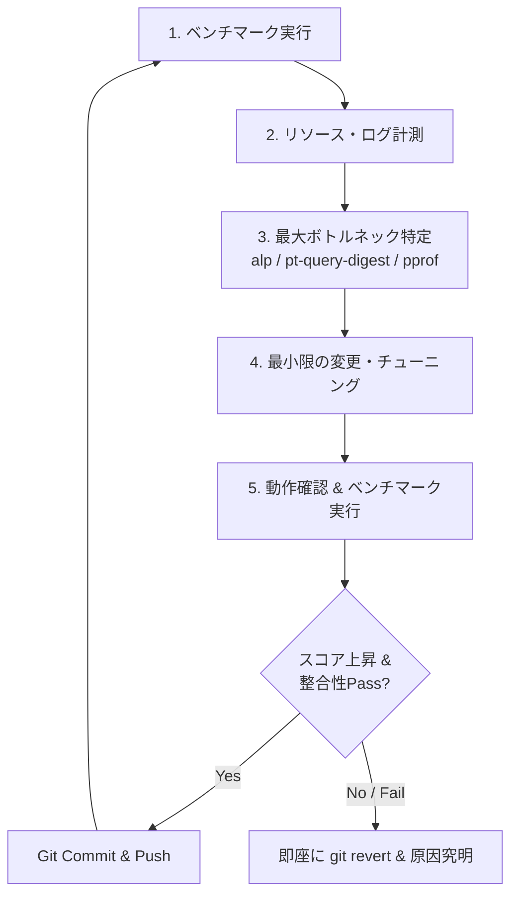

# ISUCONの基本ルール・勝つための鉄則 (01_basics.md)

---

## 🏁 ISUCONとは？

ISUCON（Iikanji ni Speed Up Contest）は、与えられたWebアプリケーション（遅い初期実装）を制限時間（通常8時間：10:00〜18:00）内にチューニングし、ベンチマークスコアを競うコンテストです。

---

## 🏆 最重要の鉄則: 「推測するな、計測せよ」

ISUCONで最もありがちな失敗は、**「遅そうだからここを直そう」と推測でコードをいじり、スコアが全く伸びない（あるいはバグらせてFailする）**ことです。

### 🔁 基本の改善サイクル

---

## ⚠️ 絶対にやってはいけないNG行動

1. **計測せずに勘で修正する**
   - 10msの処理を1msにしても、全体が1000msならスコアは1%しか上がりません。
2. **複数の修正を一度に入れてベンチマークを回す**
   - Failしたときに何が原因かわからなくなります。**1イテレーション＝1つの仮説・修正**。
3. **Gitでコミットせずに修正を重ねる**
   - 動かなくなったときに元の動く状態に戻せなくなります。
4. **マニュアル（仕様書・レギュレーション）を読まない**
   - 変更してはいけないエンドポイント、レスポンスの許容仕様、キャッシュの許容範囲（例: 「数秒の遅延は許容」「直近データの不整合は失格」等）が明記されています。
5. **最後の再起動試験をやらない**
   - ISUCONの採点は**「競技終了後にサーバーを全台再起動し、起動後にベンチマークが完走したスコア」**で決まります。再起動でサービスが立ち上がらないとスコアは **0点** です。

---

## 💡 初参加者が狙うべき戦略

- **目標**: **「全イテレーションでPassを維持し、確実に完走して中位〜上位に食い込む」**
- **典型的な勝ち筋**:
  1. 開始30分でGit化・計測環境（alp, pt-query-digest）を整備
  2. Nginxのログから最も遅い／呼び出し回数が多いエンドポイントを特定
  3. MySQLのスロークエリログから該当クエリを特定し、適切な **INDEX（複合インデックス）** を貼る
  4. ループ内のSQL（**N+1問題**）を `IN` 句や JOIN、一括取得にリファクタリング
  5. 頻繁に読まれるが更新頻度の低いデータを **インメモリキャッシュ**（Goなら `sync.Map` や map+RWMutex）や **Redis** に逃がす
  6. 静的ファイル（画像・JS/CSS）を Nginx から直接配信 & `Cache-Control` 付与
  7. 複数台構成（サーバーが3台ある場合）へ役割分散（Nginx + App 2台 + DB 1台など）
