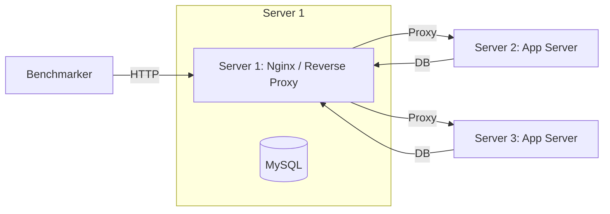

# ミドルウェア・OS設定チューニングガイド (03_middleware.md)

ISUCONにおける Nginx / MySQL / Redis / Linux OS の鉄板チューニング設定集です。

---

## 1. Nginx の鉄板設定 (`/etc/nginx/nginx.conf`)

### 基本パラメータ

```nginx
user www-data;
pid /run/nginx.pid;

# CPUコア数に合わせて自動設定
worker_processes auto;
# workerが開けるファイルディスクリプタ上限
worker_rlimit_nofile 65535;

events {
    # 1つのworkerが同時に受け入れ可能な接続数
    worker_connections 2048;
    # 複数接続を一度に受け入れる
    multi_accept on;
    # Linuxの epoll を明示
    use epoll;
}

http {
    # カーネル空間でのファイル転送（効率化）
    sendfile on;
    tcp_nopush on;
    tcp_nodelay on;

    # KeepAlive 設定
    keepalive_timeout 65;
    keepalive_requests 10000;

    # Gzip 圧縮（CPU負荷とのトレードオフ。テキストレスポンスに有効）
    gzip on;
    gzip_types text/plain text/css application/json application/javascript text/xml;
    gzip_min_length 1024;

    # アップストリームへの KeepAlive 設定
    upstream app {
        server 127.0.0.1:8000;
        # Unix Domain Socket を使うとさらに高速:
        # server unix:/tmp/app.sock;
        keepalive 64;
    }

    server {
        listen 80 default_server;
        server_name _;

        # 静的ファイルの直接配信（Nginxに任せてAppを通さない）
        location ~ ^/(css|js|images|favicon.ico)/ {
            root /home/isucon/webapp/public;
            expires 1d;
            add_header Cache-Control "public, max-age=86400, immutable";
            access_log off; # 静的ログは切る
        }

        # アプリケーションへのリバースプロキシ
        location / {
            proxy_pass http://app;
            proxy_http_version 1.1;
            proxy_set_header Connection "";
            proxy_set_header Host $host;
            proxy_set_header X-Forwarded-For $proxy_add_x_forwarded_for;
        }
    }
}
```

---

## 2. MySQL の鉄板設定 (`/etc/mysql/mysql.conf.d/mysqld.cnf`)

### メモリ・I/Oパラメータ

```ini
[mysqld]
# 最大接続数
max_connections = 1024

# 【最重要】InnoDBバッファプールサイズ (サーバー物理メモリの 60%〜75% を割り当てる)
# 例: 4GBのサーバーなら 2.5GB〜3GB
innodb_buffer_pool_size = 2500M

# ログファイルサイズ（大きいほどI/O頻度が減る）
innodb_log_file_size = 512M
innodb_log_buffer_size = 64M

# 【最重要】トランザクションログのフラッシュ頻度
# 0 or 2 にすることでディスク書き込み待ちを激減させる (ISUCONではクラッシュ耐性を犠牲にして速度全振り)
innodb_flush_log_at_trx_commit = 2

# ディスク同期方式
innodb_flush_method = O_DIRECT

# バイナリログの無効化（レプリケーションしない単一ノードなら不要）
disable-log-bin = 1
# skip-log-bin = 1 (MySQL 8.0系)

# 競技終了前のベンチマーク時はスロークエリログをOFFにする！
# slow_query_log = 0
```

> [!CAUTION]
> `innodb_buffer_pool_size` をサーバー実メモリ以上に設定すると、OSのOOM KillerによってMySQLが強制終了します。`free -m` で空きメモリを必ず確認してください。

---

## 3. Linux OS / カーネルパラメータ (`/etc/sysctl.conf`, `/etc/security/limits.conf`)

大量のリクエストを処理するためのソケット・ファイルディスクリプタの拡張です。

### `/etc/sysctl.conf`
```ini
# ソケットのバックログ上限
net.core.somaxconn = 32768
net.ipv4.tcp_max_syn_backlog = 32768

# ポート枯渇対策（ローカルポート範囲の拡大）
net.ipv4.ip_local_port_range = 1024 65535

# TIME_WAIT ソケットの再利用
net.ipv4.tcp_tw_reuse = 1
net.ipv4.tcp_fin_timeout = 10
```
反映: `sudo sysctl -p`

### `/etc/security/limits.conf`
```ini
* soft nofile 65535
* hard nofile 65535
isucon soft nofile 65535
isucon hard nofile 65535
```

---

## 4. 複数台構成（3台構成）の典型パターン

ISUCONでは通常3台のサーバーが提供されます。


- **構成パターン例**:
  - **構成A (DB分離)**: Server 1 (Nginx + App) + Server 2 (App) + Server 3 (MySQL専用)
  - **構成B (App/DB分割)**: Server 1 (Nginx + MySQL) + Server 2 (App 1) + Server 3 (App 2)
  - ※MySQLのCPU負荷が高い場合は Server 3 をMySQL専任にするのが王道です。
