# 3人チームの立ち回り・連携戦略 (06_team_strategy.md)

ISUCONにおける3人チームのタイムライン、コミュニケーション設計、コンフリクト（作業衝突）防止ルールです。

---

## 👥 3名の詳細タイムライン・アクション

```mermaid
gantt
    title ISUCON 3人チームの当日の動き
    dateFormat  HH:mm
    axisFormat  %H:%M
    section Member 1 (Infra/計測)
    SSH/Git/初期ログ設定       :00:00, 30m
    Nginx/MySQL基本設定        :00:30, 90m
    alp/pt-query集計 & 指示    :02:00, 180m
    複数台サーバー分散         :05:00, 90m
    全ログOFF & 再起動試験     :06:30, 90m
    section Member 2 (DB/クエリ)
    マニュアル読み & 初期仕様把握 :00:00, 30m
    初期スロークエリIndex貼り    :00:30, 90m
    N+1解消 (主要エンドポイント)  :02:00, 180m
    クエリ最適化/バルク処理     :05:00, 90m
    動作確認・コードフリーズ     :06:30, 90m
    section Member 3 (App/キャッシュ)
    マニュアル読み & 初期仕様把握 :00:00, 30m
    pprof仕込み & CPUプロファイル :00:30, 90m
    インメモリキャッシュ/SingleFlight :02:00, 180m
    静的配信/ロジック軽量化      :05:00, 90m
    動作確認・コードフリーズ     :06:30, 90m
```

---

## 📊 スコア記録シート（スプレッドシートやメモ帳で共有）

ベンチマークを回すたびに、以下の項目をチーム全員でリアルタイムに共有・記録します。

| # | 時刻 | 担当 | 変更内容 | Commit Hash | スコア | 状態 (Pass/Fail) | 備考・所感 |
| :-: | :-: | :-: | :--- | :--- | :---: | :---: | :--- |
| 1 | 10:20 | 全員 | 初期状態ベンチマーク | `initial` | 1,250 | PASS | 初期ベースライン |
| 2 | 10:45 | M1 | Nginx LTSV & MySQL スロークエリ有効化 | `a1b2c3d` | 1,180 | PASS | ログ出力分少しスコア低下 |
| 3 | 11:15 | M2 | usersテーブルに `idx_email` 追加 | `e4f5g6h` | 3,400 | PASS | スロークエリ1位が解消 |
| 4 | 11:50 | M3 | `/api/user/me` をインメモリキャッシュ | `7h8i9j0` | 6,800 | PASS | CPU負荷が半減 |
| 5 | 12:30 | M2 | posts一覧のN+1をIN句に修正 | `k1l2m3n` | 0 | **FAIL** | 順序が壊れて整合性エラー |
| 6 | 12:35 | M2 | `ORDER BY created_at DESC` を追加 | `o4p5q6r` | 12,500 | PASS | 修正してPass、大幅スコアUP |

---

## 🚨 コンフリクト・事故防止の3大原則

1. **「デプロイ前の声かけ」の徹底**
   - 「これから `main` にマージしてサーバーにデプロイ＆ベンチマーク回します」とDiscord/Slackで宣言。
   - 他のメンバーがサーバー上で直接作業（手動編集やテスト）していないことを確認。
2. **「1ベンチマーク＝1修正」の原則**
   - 2人が同時に別々の修正をデプロイすると、Failしたときにどちらが原因か切り分けられなくなります。
   - 必ず **コミットごとにベンチマークを実行** します。
3. **サーバー上での直接コード編集禁止（手元で編集→Git経由でデプロイ）**
   - サーバー上のファイルを直接編集すると、誰かが `git pull` した際にコンフリクトしたり変更が上書き・消失します。
   - **「手元のVS Code等で編集 → Git Push → サーバーで `make deploy`」** のフローを徹底します。
