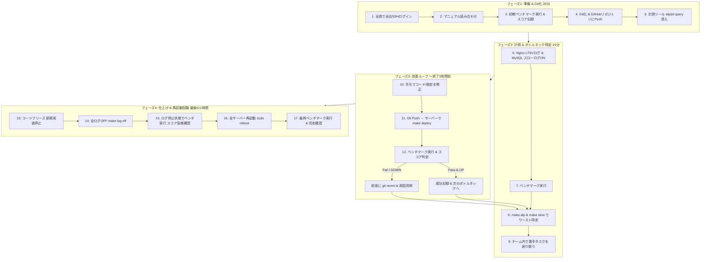

# クラウド構築後の実践ワークフロー全貌 (09_practice_walkthrough.md)

クラウド環境（サーバー3台 + ベンチマーカー1台）が立ち上がった後、実際に**ログインしてから終了までに行う全アクションの具体的な流れ**です。

---

## 🗺️ 全体の流れ（4つのフェーズ）

---

## 🛠️ 各フェーズの具体的アクション

### 【フェーズ1】準備 & Git化（最初の30分）

1. **全員がSSH接続を確認する**:
   - `ssh -i key.pem isucon@<IP1>`, `<IP2>`, `<IP3>`, `<BenchIP>`
2. **マニュアルの読み合わせ (10分)**:
   - サービスの概要、加点条件、減点・Fail条件、触ってはいけないエンドポイントを確認。
3. **初期ベンチマークの実行**:
   - 何もいじっていない状態でベンチマーカーからベンチを実行（例: スコア 1,200点）。
4. **コードと設定ファイルのGit管理化**:
   - Server 1で `/home/isucon/webapp` と `/etc/nginx`, `/etc/mysql` をGit初期化し、GitHubのプライベートリポジトリへPush。
   - メンバー全員が手元のPCに `git clone` してローカル開発環境（VS Code等）を開く。
5. **初期化スクリプト・Makefileの配置**:
   - `init_server.sh` を実行して `alp` や `percona-toolkit` を全台にインストール。

---

### 【フェーズ2】計測 & ボトルネック特定（15分）

1. **ログ出力の有効化**:
   - Nginx: LTSVフォーマットでアクセスログを記録。
   - MySQL: `long_query_time = 0.0` で全クエリをスローログに記録。
2. **ベンチマーク実行**:
   - ログが出力される状態でベンチマークを実行。
3. **ログ集計によるワースト特定**:
   - `make alp`: 一番合計時間 (`sum`) が長いエンドポイント（例: `GET /api/user/me`）を特定。
   - `make slow`: 一番実行時間を食っているSQL（例: `SELECT * FROM posts WHERE user_id = ?`）を特定。
4. **チームでタスク分担**:
   - M1: Nginx/MySQLのメモリ割り当てチューニング
   - M2: スロークエリへのINDEX追加
   - M3: 重いエンドポイントのN+1解消

---

### 【フェーズ3】改善イテレーションループ（競技中盤・何回も繰り返す）

1. **手元のPCで修正**:
   - 担当者がローカルでコードやSQLを修正。
2. **デプロイ宣言 & ベンチマーク**:
   - 「〇〇のINDEX追加をデプロイします」と宣言。
   - `git push origin feature/xxx` → `main` マージ → サーバー上で `make deploy`（`git pull` + ビルド + ログクリア + 再起動）。
   - ベンチマーカーからベンチ実行。
3. **判定**:
   - **スコア上昇 & PASS**: スコア記録表に記録し、次のボトルネックへ。
   - **FAIL または スコア低下**: 即座に `git revert` して元の状態に戻す。

---

### 【フェーズ4】仕上げ & 再起動試験（競技終了の1時間前〜）

1. **17:00: コードフリーズ**:
   - 大きな修正・新規実装を完全にストップ。
2. **17:15: 全ログOFF (`make log-off`)**:
   - Nginxのアクセスログ、MySQLのスローログを無効化して再起動。
   - ベンチマークを実行（ディスクI/Oがなくなりスコアが1.5〜2倍に跳ね上がる）。
3. **17:30: 再起動試験 (`sudo reboot`)**:
   - サーバー1〜3を全台再起動。
   - 起動後に `systemctl` でアプリ・Nginx・MySQLが自動で立ち上がっているか確認。
4. **17:45: 最終ベンチマーク**:
   - 再起動後にベンチマークが完走してPASSすることを確認。
