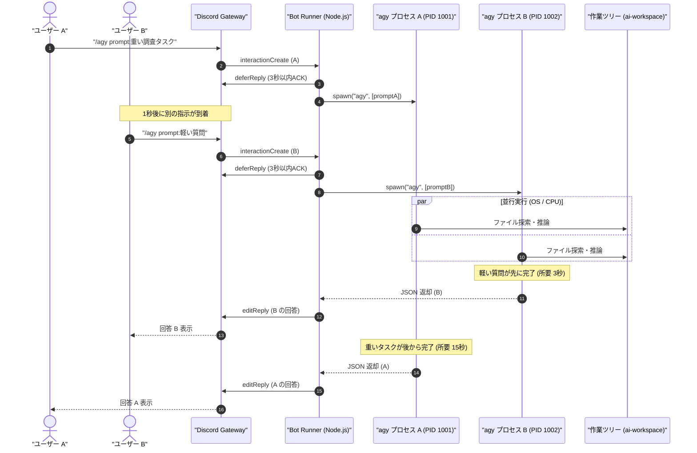

# 複数メッセージ受信時の並行実行挙動・競合リスクと制御設計

本ドキュメントは、Discord Bot Runner（`space/discord/bot/index.js`）に対して複数ユーザーや連続メッセージが同時に送信された際のシステム挙動、OS プロセス並行性、作業ツリー競合リスク、およびキューイング制御の設計をまとめた技術ノートです。

---

## 1. 現在の実装における並行実行フロー

現在の実装は Node.js の非同期イベント駆動（`child_process.spawn`）を採用しているため、**メッセージを順番待ち（キューイング）させず、受信した瞬間に OS 上で独立した `agy` サブプロセスを即座に並行起動** します。

### 1.1 シーケンス図 (2 つのメッセージが連続到着した場合)

---

## 2. 現在の挙動における特徴

1. **完全なノンブロッキング (Non-blocking)**:
   - 先行するタスク A がどれだけ重くても、後続のタスク B は待たされることなく即座に処理が開始されます。
2. **追い越し完了 (Out-of-Order Completion)**:
   - 処理時間に応じて、後から送られた質問（軽いプロンプト）が先に完了して返信されます。
   - `interaction` や `message` オブジェクトがリクエストごとに独立して保持されているため、返信先が混ざる（混線する）ことはありません。

---

## 3. 並行実行における潜在的な課題とリスク

| リスク分類 | 現象・影響 | 発生条件 |
| :--- | :--- | :--- |
| **1. 作業ツリーの競合 (最重要)** | 2 つのエージェントが同一リポジトリ内のファイルを同時に編集・書き換えし、コードや差分が破壊される | エージェントが読み取りだけでなくファイル編集 (`write_to_file`) やコマンド実行を行う場合 |
| **2. リソース過負荷** | CPU / メモリ使用率が急上昇し、Google API 側でタイムアウト (`operation timed out`) やレートリミットが発生する | 短時間に多数のメッセージが同時送信された場合 |
| **3. Git コミット・ブランチの干渉** | Git のインデックスロック (`.git/index.lock`) が衝突し、Git 操作が失敗する | エージェントが並行して git 操作を実行した場合 |

---

## 4. 解決・制御アーキテクチャの選択肢

### 方式 1: 直列キューイング (FIFO Queue / Concurrency = 1) 【最も安全で手軽】
リクエストをインメモリ配列（キュー）に積み、**同時に動く `agy` プロセスを常に 1 つに制限** します。
- **メリット**: ファイル編集の衝突が 100% 発生しない。マシンの CPU/メモリ消費が常に安定。
- **デメリット**: 前のタスクが終わるまで次のタスクの回答が遅延する（ただし `deferReply` で 15 分間は待機可能）。

### 方式 2: Git Worktree 自動分離方式 【高機能・完全並行】
リクエストごとに独立した Git Worktree（`.worktrees/<uuid>/`）を一時作成し、そのディレクトリを `cwd` として `agy` を実行します。
- **メリット**: 複数タスクが同時にファイルを編集・コミットしても、作業ツリーが完全に分離されているため一切衝突しない。
- **デメリット**: ディスク容量と Worktree 作成・削除のオーバーヘッドが発生。

---

## 5. 参考リソース

* [Node.js Documentation: Child Process (spawn)](https://nodejs.org/api/child_process.html#child_processspawncommand-args-options)
* [discord.js Guide: Handling Concurrent Interactions](https://discordjs.guide/popular-topics/common-questions.html)
* [Git Documentation: git-worktree](https://git-scm.com/docs/git-worktree)
