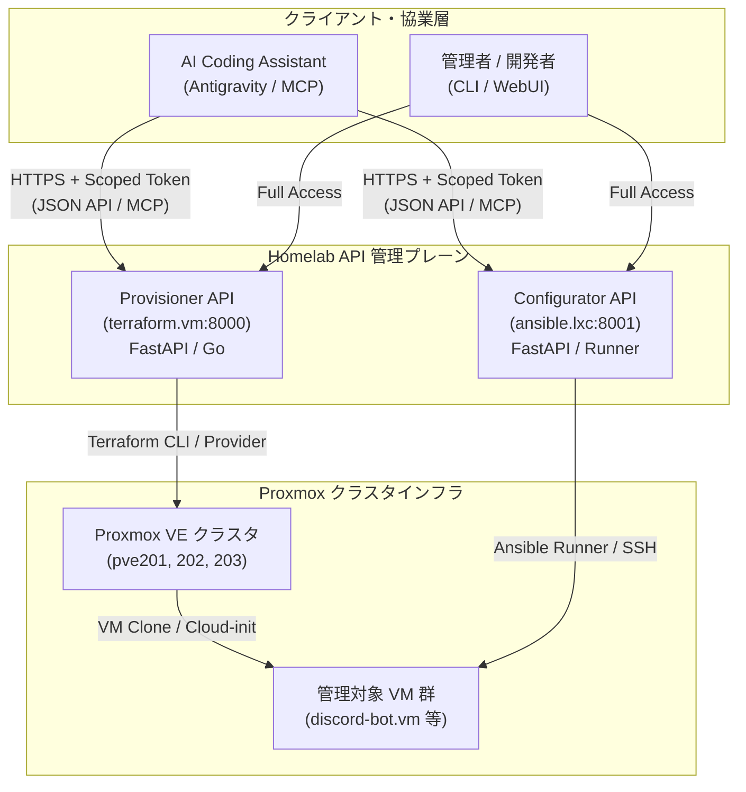

# API駆動型 Homelab オーケストレーション基盤設計 (10_api_driven_homelab_orchestration_architecture.md)

本ドキュメントは、Proxmox VM のプロビジョニング基盤（Terraform）および構成管理基盤（Ansible）を単なる SSH スクリプト実行から昇華させ、各基盤を **軽量な API サーバー化** することで、AI エージェントとの協業において柔軟な権限分離（RBAC）、非同期ジョブ制御、構造化ステータス返却を実現するシステムアーキテクチャの設計書です。

---

## 1. 背景と課題意識 (Why API-Driven?)

### 1.1 スクリプト・SSH 直接実行方式の限界
従来の「AI エージェントが SSH 経由で直接 `terraform apply` や `ansible-playbook` を実行する」方式には、以下の本質的な運用課題が存在します。

1. **過大な特権の露出**:
   - エージェントに root や sudo 可能ユーザーの SSH 生シェル権限を渡す必要があり、「誤ってクラスタ全体や他の VM を破壊する」リスクを論理的に制限できません。
2. **非対話実行の脆弱性**:
   - `ansible.cfg` の対話型プロンプト（`BECOME password:`）や `.bashrc` の対話シェル判定（`[ -z "$PS1" ]`）など、OS/シェル層の微妙な振る舞いでプロセスがハング・失敗します。
3. **生テキスト出力によるトークン浪費**:
   - 数百行に及ぶ ANSI カラー付きログ、apt の進行ゲージ、警告メッセージが生のまま AI コンテキストに流れ込み、トークン消費とレイテンシを圧迫します。
4. **ジョブライフサイクルの不透明さ**:
   - VM クローン作成や apt upgrade のような数分かかる長時間タスクにおいて、「現在どのフェーズか」「正常に進行しているか」を構造的に把握しづらいです。

---

## 2. API 駆動型アーキテクチャ概要

`terraform.vm` と `ansible.lxc` をそれぞれ専用のマイクロ API サービスとして稼働させ、AI エージェントおよびクライアント端末はその API と JSON / イベント経由でのみ通信します。



---

## 3. 権限設計とセキュリティ境界の柔軟化 (RBAC & Scoped Tokens)

API サーバーを挟むことで、OS シェルの root 権限を完全に秘匿し、AI エージェントに対する **きめ細やかな認可制御（Least Privilege）** を実現します。

| 権限スコープ | 許可される操作 | 制約・ガードレール |
| :--- | :--- | :--- |
| `vm:read` | VM 一覧取得、稼働ステータス取得、IP 逆引き | 読み取り専用 |
| `vm:create` | 指定スペック内での新規 VM 起票 | 最大コア数: 4, 最大メモリ: 8GB, 許可ノード限定 |
| `vm:restart` | VM の再起動・停止 | 管理対象外（`pve201` 自体や `k8s-ctl` 等）は対象外 |
| `vm:destroy` | VM の破棄 | **AI エージェントには原則不許可**。人間の Webhook 承認必須 |
| `config:init` | 初期化 Playbook (`init-vm`) の適用 | 実行可能ターゲットを新規 VM に限定 |

### 認証・認可フロー
* AI エージェントには環境変数として `HOMELAB_API_TOKEN`（Bearer トークン）を 1 つ付与。
* API サーバー側でトークンごとのスコープを検証し、許可されたスキーマ以外のリクエスト（例: 巨大リソースの要求や保護ノードの操作）を 403 Forbidden で即時遮断します。
* Proxmox API トークン（`fa2d9a7b-...`）や Ansible の SSH 秘密鍵は API サーバー内部に完全に隔離され、外部（AI セッション）には一切露出しません。

---

## 4. API インターフェース仕様（OpenAPI / REST）

### 4.1 Provisioner API (`terraform.vm`)

#### (1) 新規 VM 起票 (非同期ジョブ)
* **エンドポイント**: `POST /api/v1/vms`
* **リクエスト例**:
  ```json
  {
    "name": "discord-bot",
    "vmid": 235,
    "ip": "192.168.11.235",
    "cores": 2,
    "memory_mb": 4096,
    "disk_gb": 32,
    "target_node": "pve201"
  }
  ```
* **レスポンス例 (202 Accepted)**:
  ```json
  {
    "job_id": "job_tf_8f3a91b2",
    "status": "in_progress",
    "created_at": "2026-10-02T23:25:00Z",
    "poll_url": "/api/v1/jobs/job_tf_8f3a91b2"
  }
  ```

#### (2) ジョブステータス確認
* **エンドポイント**: `GET /api/v1/jobs/{job_id}`
* **レスポンス例 (完了時)**:
  ```json
  {
    "job_id": "job_tf_8f3a91b2",
    "status": "succeeded",
    "duration_seconds": 32,
    "result": {
      "name": "discord-bot",
      "vmid": 235,
      "ip": "192.168.11.235",
      "state": "running"
    }
  }
  ```

#### (3) 構造化 VM 一覧
* **エンドポイント**: `GET /api/v1/vms`
* **レスポンス例**:
  ```json
  {
    "vms": [
      { "vmid": 215, "name": "dev-vm", "status": "running", "node": "pve201", "ip": "192.168.11.215" },
      { "vmid": 235, "name": "discord-bot", "status": "running", "node": "pve201", "ip": "192.168.11.235" }
    ]
  }
  ```

---

### 4.2 Configurator API (`ansible.lxc`)

#### (1) Playbook 実行
* **エンドポイント**: `POST /api/v1/playbooks/run`
* **リクエスト例**:
  ```json
  {
    "playbook": "init-vm",
    "target": "discord-bot.vm",
    "extra_vars": {}
  }
  ```
* **レスポンス例 (202 Accepted)**:
  ```json
  {
    "task_id": "task_ans_4c9d11",
    "status": "running",
    "events_stream_url": "/api/v1/tasks/task_ans_4c9d11/events"
  }
  ```

#### (2) 実行ログ・ステータス
* **エンドポイント**: `GET /api/v1/tasks/{task_id}`
* リアルタイムのタスク完了状況（`TASK [install_docker] ... ok`）を構造化 JSON で返却。エージェントは正規表現パースに悩まされることなく、成功/失敗を判定できます。

---

## 5. AI エージェント (MCP) との統合メリット

1. **MCP (Model Context Protocol) サーバーとしての直接公開**:
   - FastAPI の OpenAPI 定義から MCP ツールを自動公開することで、AI エージェントは `mcp_provision_vm(name="discord-bot", ...)` や `mcp_get_vm_status(name="discord-bot")` をネイティブ関数呼び出し（Function Calling）できます。
2. **トークン消費の極小化**:
   - 生の端末ログ（数千トークン）の代わりに、クリーンな要約 JSON（数十トークン）のみが会話履歴に入るため、コンテキスト圧迫を 95% 以上削減できます。
3. **安全な Human-in-the-Loop**:
   - 危険なパラメータやリソース過剰な操作に対して、API が `requires_human_approval: true` を返し、Discord やチャット UI 側でユーザーが「承認」ボタンを押すまで待機する安全弁を自然に組み込めます。

---

## 6. 実装スタックの推奨選定

* **Web フレームワーク**: FastAPI (Python)
  - 理由: `pydantic` による厳密な入力バリデーション、自動生成される OpenAPI (Swagger) スキーマ、非同期 BackgroundTasks サポート。
* **ジョブ実行基盤**:
  - Terraform 側: `python-terraform` または `subprocess.Popen` + 非同期キュー
  - Ansible 側: `ansible-runner` (Red Hat 公式の Python ライブラリ・API バックエンド)
* **常駐化**: `systemd` サービス化（ポート 8000 / 8001）

---

## 7. 権威ある参考リソース

* [FastAPI Official Documentation & OpenAPI Support](https://fastapi.tiangolo.com/)
* [Ansible Runner Documentation (Red Hat)](https://ansible-runner.readthedocs.io/en/latest/)
* [HashiCorp Terraform Cloud Run API Reference](https://developer.hashicorp.com/terraform/cloud-docs/api-docs)
* [Model Context Protocol (MCP) Specification](https://modelcontextprotocol.io/)
* [NIST Special Publication 800-207: Zero Trust Architecture](https://csrc.nist.gov/publications/detail/sp/800-207/final)
