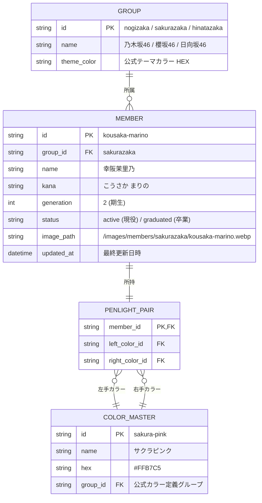

# データモデリング・画像管理・フィルタリング共通化設計 (02_data_modeling_and_helper_architecture.md)

本ドキュメントは、Penlight Quiz v2 の実装を極力シンプルかつ堅牢にするための **先行データモデリング**、**画像登録・データ更新フロー**、および **純粋関数によるフィルタリングヘルパーの切り出し設計** をまとめたものです。

---

## 1. 先行データ構造の定義 (TypeScript / SQLite スキーマ)

UI やロジックを実装する前に、核となるデータエンティティを整理し、型の一貫性を担保します。



### 1.1 TypeScript 型定義 (`src/types/index.ts`)
```typescript
export type GroupId = 'nogizaka' | 'sakurazaka' | 'hinatazaka';
export type MemberStatus = 'active' | 'graduated';

export interface ColorMaster {
  id: string;          // 'pastel-blue'
  name: string;        // 'パステルブルー'
  hex: string;         // '#89CFF0'
  textColor?: string;  // バッジ表示用の文字色 ('#000' または '#fff')
}

export interface Member {
  id: string;          // URL・画像ファイル名キー ('morita-hikaru')
  name: string;        // '森田ひかる'
  kana: string;        // 'もりた ひかる'
  groupId: GroupId;
  generation: number;  // 2
  status: MemberStatus;
  imagePath: string;   // '/members/sakurazaka/morita-hikaru.webp'
  penlight: {
    leftColor: ColorMaster;
    rightColor: ColorMaster;
  };
}

export interface QuizQuestion {
  id: string;
  member: Member;
  options: {
    id: string;
    leftColor: ColorMaster;
    rightColor: ColorMaster;
    isCorrect: boolean;
  }[];
}
```

---

## 2. フィルタリング処理の専用ヘルパー切り出し (`src/lib/filters.ts`)

UI コンポーネント（Mantine）の内部にロジックを埋め込まず、単体テスト（Jest / Vitest）が 100% 可能な純粋関数（Pure Functions）として抽出します。

### 提供する共通ヘルパー関数群
* `filterByGroup(members: Member[], groupId: GroupId): Member[]`
* `filterByStatus(members: Member[], status: MemberStatus): Member[]`
* `filterByGeneration(members: Member[], generation: number): Member[]`
* `filterByColor(members: Member[], colorId: string): Member[]`: 特定の色を片方でも含むメンバーを抽出
* `searchByName(members: Member[], query: string): Member[]`: 漢字・ひらがな・ローマ字でのインクリメンタル検索
* `composeFilters(members: Member[], criteria: FilterCriteria): Member[]`: 複合条件をパイプライン適用

### ダミー選択肢（誤答）生成ヘルパー (`src/lib/quiz-generator.ts`)
クイズ出題において「正解以外の 3 択」を生成する際、ランダム抽出ではなく以下のインテリジェントな絞り込みを行います。
1. **同グループ内優先**: 乃木坂の問題には乃木坂メンバーのカラーペアを誤答として優先選定。
2. **類似ペアの防止**: 正解と左右が逆なだけのペア（例: [青, 赤] に対する [赤, 青]）は誤答候補から除外または明示的トラップとして制御。

---

## 3. 画像登録フォームとデータ更新の容易化設計

新メンバー加入やペンライトカラー変更時のメンテナンス負荷を最小化するため、管理用 UI（または CLI）を整備します。

### 3.1 管理フォーム UI（Mantine による簡易管理画面）
* **パス**: `/admin`（ローカル環境または IP 制限）
* **機能**:
  1. **画像アップロード & プレビュー**:
     - ドラッグ＆ドロップで顔写真をアップロード。
     - 自動で正方形クロップ＆WebP 変換（ブラウザ側 Canvas または API 側 Sharp）。
  2. **カラーピッカー連動**:
     - 公式 15 色カラーパレットから左右の色をクリックで選択。
     - 選択した 2 色のグラデーションプレビューをリアルタイム描画。
  3. **ワンクリック保存**:
     - SQLite DB へ Upsert（登録・更新）。
     - 画像ファイルを静的アセットディレクトリ（`public/images/members/`）へ保存。

### 3.2 Git 連携（SSOT としての JSON / Seed 出力）
* 管理画面で更新したデータは、SQLite だけでなく `data/members.json` に即座にダンプ可能にする。
* これにより、DB ファイルそのものを Git 管理しなくても、JSON をリポジトリにコミットすれば k8s ビルド時に常に最新のマスタデータが SQLite に反映される安全な運用（GitOps 整合）が保てます。

---

## 4. 次のステップ

1. **初期マスタデータ（乃木坂・櫻坂・日向坂の現役メンバー）の JSON スキーマ化**
2. **純粋ヘルパー関数群（フィルタリング・クイズ生成）の TDD（テスト駆動）実装**
3. **Mantine v8 を用いたクイズ画面・管理フォームのプロトタイピング**
