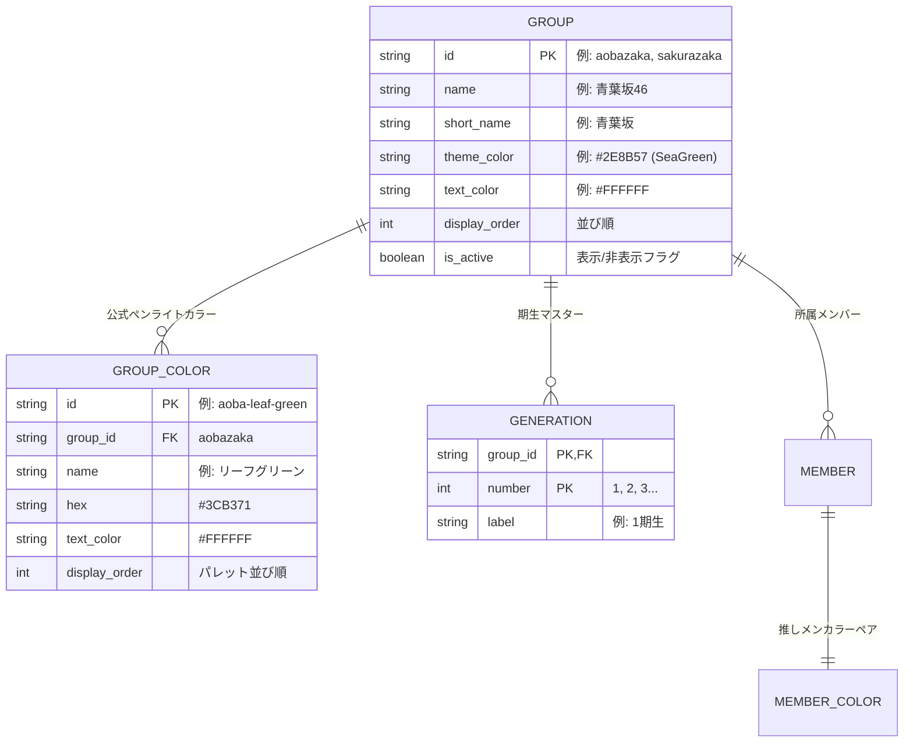

# 拡張可能グループ設計と「青葉坂46」対応アーキテクチャ (03_extensible_group_architecture_and_aobazaka.md)

本ドキュメントは、「将来的に **青葉坂46** などの新グループが追加されても、コードの改修・再デプロイなしに動的拡張できる（Open-Closed Principle）」を実現するための、データドリブンなアーキテクチャ設計書です。

---

## 1. なぜ従来のハードコード設計を脱却すべきか？

旧来の設計では、グループや期生、公式カラーが TypeScript の Union 型や `switch` 文に固定されがちでした。

```typescript
// 避けるべきハードコード設計（拡張に閉ざされている）
type GroupId = 'nogizaka' | 'sakurazaka' | 'hinatazaka'; // 青葉坂が出た時にコード修正が必要

switch (member.groupId) {
  case 'sakurazaka': return '#F19CA7';
  case 'hinatazaka': return '#70C0E8';
  // 新グループ追加のたびに全ファイル修正・ビルドが必要になる
}
```

このアプローチを全廃し、**「グループ、公式カラー、メンバーの全データをデータベース（または JSON）マスタから完全に動的生成する」** データドリブン構造へシフトします。

---

## 2. 拡張可能なデータモデル設計 (Open to Extension)

グループ自体を独立した第 1 級エンティティ（First-class Entity）とし、カラーパレットやテーマ属性を内包させます。



### 2.1 スキーマ定義のポイント
1. **グループの自己完結性**:
   - テーマカラー、UI バッジ文字色、ロゴ/アイコンパス、有効フラグを `groups` テーブルで保持。
2. **グループ専用カラーパレット**:
   - グループごとに公式ペンライト（15色など）のラインナップが異なる場合も、`group_colors` に紐づくため青葉坂独自のカラー（例: 「若草色」「深緑」「エメラルド」等）をいくらでも追加可能。
3. **型定義の柔軟化**:
   ```typescript
   export interface Group {
     id: string;          // 'aobazaka'
     name: string;        // '青葉坂46'
     shortName: string;   // '青葉'
     themeColor: string;  // '#2E8B57'
     textColor: string;   // '#FFFFFF'
     displayOrder: number;
     isActive: boolean;
   }
   ```

---

## 3. UI コンポーネントの完全データドリブン化

フロントエンド（Next.js + Mantine）側の画面は、ハードコードされたタブやボタンを持たず、マスタデータから自動描画されます。

### 3.1 グループ選択タブの自動生成
```tsx
// グループ一覧データから動的にタブを生成
<Tabs defaultValue={groups[0]?.id}>
  <Tabs.List>
    {groups.map((group) => (
      <Tabs.Tab 
        key={group.id} 
        value={group.id}
        style={{ '--tab-color': group.themeColor }}
      >
        {group.shortName}
      </Tabs.Tab>
    ))}
  </Tabs.List>
</Tabs>
```

### 3.2 管理画面 (`/admin`) でのグループ即時追加
* 管理フォームに「グループ管理」タブを用意。
* 「青葉坂46」の名前、テーマカラー（カラーピッカー）、公式ペンライトカラー一覧を入力して保存するだけで、**コード変更なし・デプロイなしでクイズや一覧に即時反映** されます。

---

## 4. 「青葉坂46」初期マスタデータのシード例 (`data/groups/aobazaka.json`)

```json
{
  "id": "aobazaka",
  "name": "青葉坂46",
  "shortName": "青葉坂",
  "themeColor": "#2E8B57",
  "textColor": "#FFFFFF",
  "displayOrder": 4,
  "isActive": true,
  "colors": [
    { "id": "aoba-green", "name": "青葉グリーン", "hex": "#2E8B57" },
    { "id": "wakakusa", "name": "若草色", "hex": "#7BA23F" },
    { "id": "shinryoku", "name": "深緑", "hex": "#00552E" },
    { "id": "white", "name": "ホワイト", "hex": "#FFFFFF" }
  ],
  "generations": [
    { "number": 1, "label": "1期生" }
  ]
}
```

---

## 5. 結論と効果

このオープンな設計により：
* 「青葉坂46」の追加だけでなく、将来的な新期生追加や卒業生のステータス変更も、JSON 編集または管理画面のボタン 1 つで安全に完結します。
* AI エージェントに新メンバーの追加を指示する際も、「`aobazaka.json` に新メンバーのオブジェクトを 1 つ追記して」と伝えるだけで済み、トークン消費とバグのリスクを最小化できます。
