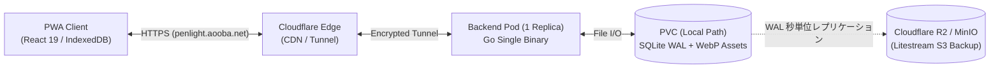
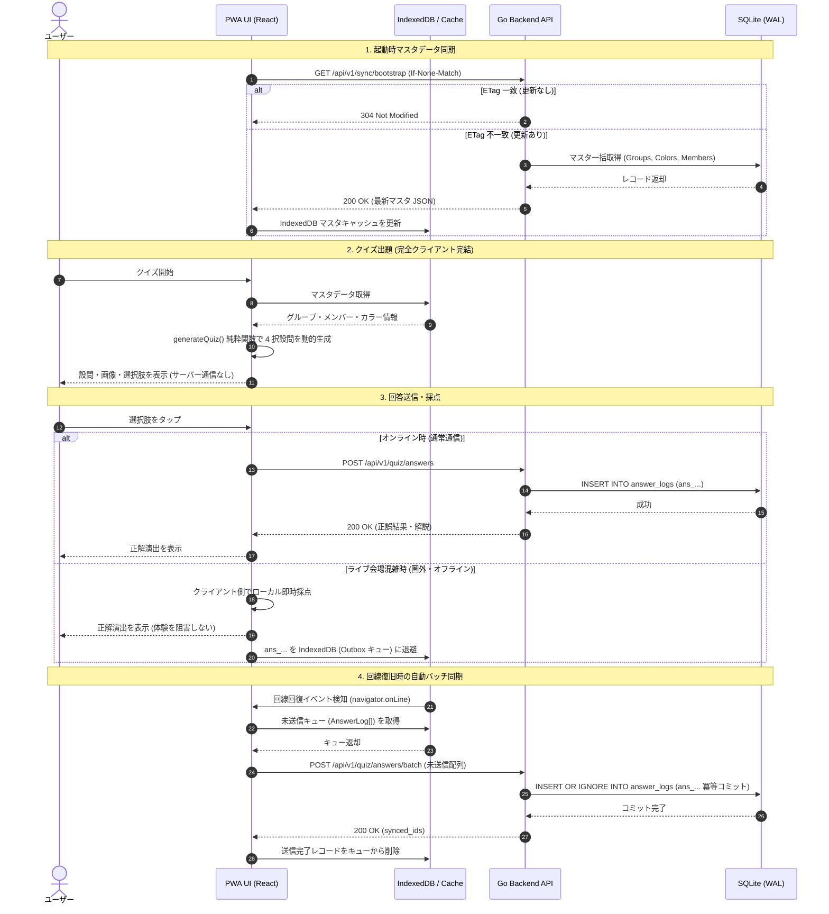

# システム全体アーキテクチャ統合仕様書 (19_system_architecture_overview.md)

本ドキュメントは、Penlight Quiz v2 における **クライアント層、エッジ・ネットワーク層、バックエンド層、データ永続化層、および開発・自動生成ツールチェーン** の全体像を俯瞰するための総合アーキテクチャ仕様書です。

---

## 1. ランタイム・システム構成概要

| レイヤ | 実行環境 / コンポーネント | 採用技術 | 主な責務・境界 | 状態・データ保持 | 通信 / プロトコル | 根拠 ADR |
|---|---|---|---|---|---|---|
| **Client** | ブラウザ (Mobile / Desktop) | React 19, Next.js (SSG), Mantine v8 | UI描画、オフライン出題、回答一時保存 | CacheStorage (静的/画像), IndexedDB (マスタ/未送信キュー) | HTTPS, JSON | ADR-0007, ADR-0011 |
| **Edge / Ingress** | Cloudflare Edge, k8s Ingress | Cloudflare Tunnel, cert-manager | DNS、TLS終端、不変画像配信キャッシュ | エッジキャッシュ (`immutable`) | HTTP/2, QUIC | ADR-0003, ADR-0008 |
| **Server** | k8s Pod (自宅 Proxmox, 1 Replica) | Go 1.22+, `net/http` | REST API、出題ロジック、画像変換、認証管理 | ステートレス (セッションはCookie/DB照合) | REST (JSON), TypeID | ADR-0002, ADR-0009 |
| **Storage** | k8s PVC (Local Path) | SQLite (WAL), Litestream | マスタ・回答ログ永続化、オブジェクト差分同期 | SQLite ファイル, WebP アセット | ファイル I/O, S3 互換同期 | ADR-0005, ADR-0012 |

> **開発・ビルド時ツールチェーン (非ランタイム)**:
> スキーマ自動同期 (`tygo`, AST解析スクリプト) および静的検査・衛生ツール (`Biome`, `Knip`, `sqlc`, `typos`) はランタイムには含まれず、開発時・CIパイプライン上でのみ機能します（詳細は [ADR-0004](file:///Users/aobaiwaki/ai-workspace/space/penlight-v2/adr/0004-go-schema-as-single-source-of-truth.md), [ADR-0013](file:///Users/aobaiwaki/ai-workspace/space/penlight-v2/adr/0013-typescript-ai-agent-driven-development-toolchain.md) を参照）。

---

## 2. システム構成ブロック図 (Mermaid)

システム全体の物理境界とネットワーク通信経路を極限までシンプルに表現したブロック図です（内部モジュール細部を排除し、配置と通信に特化）。

---

## 3. クイズ出題・回答・オフライン同期シーケンス図 (Mermaid)

Local-First 設計における「マスタ同期」「出題」「オンライン即時採点」「会場圏外時のローカル退避とバッチ同期」の相互作用シーケンスです。

---

## 4. データフローと状態ライフサイクル仕様

### 4.1 クイズ出題・回答同期ライフサイクル (Online / Offline Sync)

| フェーズ | アクター / トリガー | 処理内容 / 通信 | 入力 / 出力 | 永続化先 | 障害・オフライン時ハンドリング |
|---|---|---|---|---|---|
| **マスタ同期** | クライアント起動 / 定期取得 | `GET /api/v1/sync/bootstrap` | In: `If-None-Match: <ETag>` Out: 304 Not Modified または マスタJSON (`groups`, `colors`, `members`) | クライアント `IndexedDB:master` | 通信切断時はローカル IndexedDB の既存データを継続利用 |
| **出題生成** | クイズ画面遷移 | クライアント側純粋関数 (`generateQuiz`) による抽出 | In: 選択グループ/期生ID, ColorMap Out: `QuizQuestion` (4択設問データ) | クライアント メモリ (Zustand) | 完全クライアント完結 (サーバーアクセス不要) |
| **回答処理 (オンライン)** | ユーザー選択 | `POST /api/v1/quiz/answers` | In: `quiz_id`, `member_id`, `selected_choice` Out: 採点結果, 正解メタデータ, `ans_...` | サーバー SQLite `answer_logs` | 通信失敗・タイムアウト時は「回答一時退避」へフォールバック |
| **回答一時退避 (オフライン)** | 回答時の通信エラー / 圏外判定 | ローカル採点およびキューイング | In: 回答データ Out: 画面上への採点結果即時反映 | クライアント `IndexedDB:outbox` | 最大1,000件保持 (FIFO)。未同期フラグ付きで保持 |
| **バッチ同期** | ネットワーク復旧 (`online` イベント) | `POST /api/v1/quiz/answers/batch` | In: `AnswerLog[]` (未同期キュー) Out: 同期完了IDリスト (`ans_id[]`) | サーバー SQLite `answer_logs` | クライアント生成の TypeID (`ans_...`) による主キー重複排除 (冪等性保証) |

### 4.2 メンバー・画像アセット登録ライフサイクル (Asset Pipeline)

| フェーズ | 担当コンポーネント | 処理内容 | 入出力 | 格納先 / キャッシュ制御 |
|---|---|---|---|---|
| **1. リクエスト受付** | Go API (`POST /api/v1/admin/members`) | 認証検証 (Admin権限) およびマルチパートフォーム受信 | In: フォームデータ (`name`, `group_id`, `color_ids`, 画像バイナリ) | 一時メモリバッファ |
| **2. 画像最適化** | Go パイプライン (`pkg/image`) | EXIFメタデータ完全除去、長辺400pxへの縮小リサイズ、WebPエンコード (品質82) | In: 原本バイナリ (JPEG/PNG) Out: WebP バイナリ | ファイル名決定: `mem_<uuidv7>.webp` |
| **3. アセット保存** | Go ファイル I/O | ディスク書き込み | In: WebP バイナリ | k8s PVC (`/data/assets/mem_<uuidv7>.webp`) |
| **4. レコード登録** | Go SQLite リポジトリ | `Member` レコードをトランザクション内で作成 | In: `Member` struct (`image_url: /assets/mem_...webp`) | SQLite `members` テーブル |
| **5. 配信・キャッシュ** | Go 静的ハンドラ + Cloudflare Edge | HTTP ヘッダー付与による配信 | In: `GET /assets/mem_*.webp` Out: 200 OK + WebP | `Cache-Control: public, max-age=31536000, immutable` Cloudflare エッジキャッシュ 1年間保持 (パージ不要) |

---

## 5. 参考文献・関連ドキュメント

- [ADR 一覧・分類インデックス](file:///Users/aobaiwaki/ai-workspace/space/penlight-v2/adr/README.md)
- [正本スキーマ仕様書 (note/05)](file:///Users/aobaiwaki/ai-workspace/space/penlight-v2/note/05_schema_and_domain_specification.md)
- [自動生成 ER 図 (assets/schema/er-diagram.md)](file:///Users/aobaiwaki/ai-workspace/space/penlight-v2/assets/schema/er-diagram.md)
- [総合 API 仕様書 (note/10)](file:///Users/aobaiwaki/ai-workspace/space/penlight-v2/note/10_api_specification_and_endpoints.md)
- [Local-First オフライン PWA 設計 (note/11)](file:///Users/aobaiwaki/ai-workspace/space/penlight-v2/note/11_local_first_offline_pwa_architecture.md)
