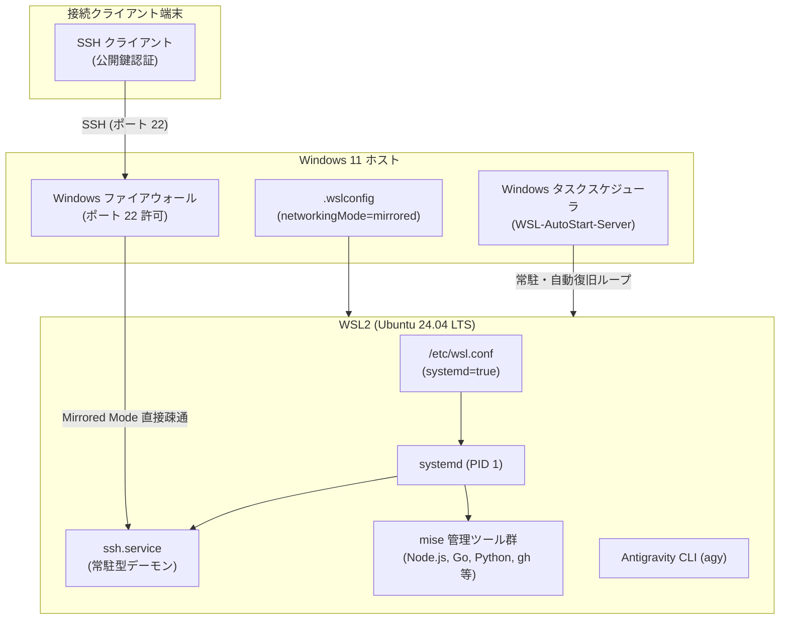

# WSL サーバー構築・運用 統合手順書 (SERVER_SETUP_GUIDE.md)

本ドキュメントは、Windows 11 上で WSL2（Ubuntu 24.04 LTS）を用いた常時稼働サーバー環境をゼロから構築・運用するための完全な単一手順書（Runbook）です。
記載されているコマンドを順に実行することで、再現性の高いセキュアなサーバー環境を確立できます。

---

## 1. 全体アーキテクチャ & 前提条件

### 1.1 前提環境
- **ホスト OS**: Windows 11 (22H2 / 23H2 以降推奨)
- **WSL バージョン**: WSL2 (WSL 2.0.0 以降)
- **ゲスト OS**: Ubuntu 24.04 LTS (Noble Numbat)
- **ネットワーク**: Mirrored モード (`networkingMode=mirrored`)
- **ツール管理**: `mise` による宣言的管理 (ADR-0003, ADR-0004)
- **認証方式**: 公開鍵認証必須 / パスワード認証完全無効化 (ADR-0005)

### 1.2 全体構成図



---

## 2. Step 1: Windows 側の初期準備

### 2.1 WSL2 のインストールと Ubuntu 24.04 の導入
Windows ターミナル（管理者 PowerShell）で実行します：

```powershell
# WSL2 と Ubuntu 24.04 のインストール
wsl --install -d Ubuntu-24.04

# インストール済みディストリビューションとバージョンの確認
wsl --list --verbose
```

### 2.2 `%USERPROFILE%\.wslconfig` の配置 (Mirrored モード)
Windows ホスト側のユーザーディレクトリ（`C:\Users\<ユーザー名>\.wslconfig`）に以下を設定します：

```ini
[wsl2]
networkingMode=mirrored
firewall=true
autoProxy=true

[experimental]
autoMemoryReclaim=gradual
```

PowerShell から直接作成する場合：
```powershell
@'
[wsl2]
networkingMode=mirrored
firewall=true
autoProxy=true

[experimental]
autoMemoryReclaim=gradual
'@ | Out-File -FilePath "$HOME\.wslconfig" -Encoding utf8
```

### 2.3 Windows ファイアウォールのポート開放
外部（LAN 内の別 PC 等）から SSH 接続できるように、ポート 22 の受信規則を追加します（管理者 PowerShell）：

```powershell
New-NetFirewallRule -Name "WSL-SSH-Inbound" -DisplayName "WSL SSH Server (Port 22)" -Direction Inbound -LocalPort 22 -Protocol TCP -Action Allow
```

---

## 3. Step 2: Windows タスクスケジューラによる常駐化 & 自動復旧

Windows 起動時にバックグラウンドで WSL を常時稼働させ、Ubuntu 内部での `sudo reboot` 時にも自動で再起動・復電させる監視タスクを登録します。

### 3.1 自動起動タスクの登録
管理者権限のコマンドプロンプト（CMD）または PowerShell で、リポジトリ内の `setup-autostart.bat` を実行します：

```cmd
:: リポジトリの scripts ディレクトリから実行
cd /d "C:\path\to\ai-workspace\wsl-server\scripts"
setup-autostart.bat
```

または PowerShell から実行：
```powershell
Start-Process -FilePath "cmd.exe" -ArgumentList "/c setup-autostart.bat" -Verb RunAs
```

### 3.2 登録状態の確認
```powershell
Get-ScheduledTask -TaskName "WSL-AutoStart-Server"
```
`State` が `Running` になっていれば常駐化は成功です。

---

## 4. Step 3: WSL Ubuntu 基盤の初期設定

WSL ターミナル（`wsl -d Ubuntu-24.04`）に入り、基盤設定を行います。

### 4.1 `/etc/wsl.conf` の設定 (systemd 有効化)
WSL 内部で systemd を有効にします：

```bash
sudo tee /etc/wsl.conf << 'EOF'
[boot]
systemd=true

[network]
generateResolvConf=true
EOF
```

### 4.2 パッケージ更新と基本ツールの導入
```bash
sudo apt update && sudo apt upgrade -y
sudo apt install -y curl git jq openssh-server
```

### 4.3 SSH Socket Activation の停止と常駐型サービスの有効化 (Ubuntu 24.04 対策)
Ubuntu 24.04 特有のソケット競合を解消し、常駐サービスに固定します：

```bash
sudo systemctl disable --now ssh.socket
sudo systemctl enable --now ssh.service
```

---

## 5. Step 4: クライアントからの接続確認と公開鍵の登録

### 5.1 クライアント端末側での鍵生成（未作成の場合）
クライアント端末（Mac / 他 PC）のターミナルで実行：

```bash
ssh-keygen -t ed25519 -C "your_email@example.com"
```

### 5.2 公開鍵の WSL サーバーへの転送・登録
クライアント端末から以下のいずれかの方法で公開鍵を登録します：

**方法 A (ssh-copy-id を使用):**
```bash
ssh-copy-id <ユーザー名>@<WindowsホストのIPアドレス>
```

**方法 B (WSL ターミナルで直接登録):**
```bash
mkdir -p ~/.ssh && chmod 700 ~/.ssh
echo "ssh-ed25519 AAAA...[公開鍵の文字列]..." >> ~/.ssh/authorized_keys
chmod 600 ~/.ssh/authorized_keys
```

---

## 6. Step 5: 宣言的開発環境のセットアップ (mise + agy)

リポジトリのスクリプトを用いて、言語ランタイムおよび開発ツールを一括導入します。

### 6.1 リポジトリの取得とセットアップスクリプトの実行
```bash
# WSL ターミナル内で実行
cd ~/ai-workspace
./wsl-server/scripts/setup-mise.sh
```

### 6.2 シェル設定の反映
```bash
source ~/.bashrc

# 導入されたツールの確認
mise current
agy --version
```

### 6.3 Antigravity CLI (`agy`) の初回認証
```bash
agy
```
ターミナルに表示される URL をブラウザで開き、Google アカウントでログインを完了します。

---

## 7. Step 6: SSH セキュリティ強化 (SSH Hardening)

公開鍵認証の必須化、パスワード認証の遮断、root ログイン禁止を安全に適用します。

### 7.1 セキュリティ強化スクリプトの実行
```bash
sudo ./wsl-server/scripts/harden-ssh.sh
```

### 7.2 自動配備される設定 (`/etc/ssh/sshd_config.d/99-server-hardening.conf`)
- `PubkeyAuthentication yes`: 公開鍵認証のみ許可
- `PasswordAuthentication no`: パスワード認証を完全無効化
- `PermitEmptyPasswords no`: 空パスワードの拒絶
- `KbdInteractiveAuthentication no`: 対話型パスワード認証を遮断
- `PermitRootLogin no`: root 直接ログインを禁止

### 7.3 接続テスト
**現在のターミナルを開いたまま**、クライアント端末の別ターミナルから SSH 接続できることを確認します：
```bash
ssh <ユーザー名>@<WindowsホストのIPアドレス>
```

---

## 8. 運用・管理コマンドリファレンス

### 8.1 サービス状態とログの確認
```bash
# SSH サービスの状態
systemctl status ssh.service

# SSH のリアルタイムログ監視
journalctl -u ssh.service -f
```

### 8.2 再起動と自律復旧のテスト
```bash
# WSL 内部からの再起動（Windows 側の監視ループにより 1〜2分で自動復帰）
sudo reboot
```

### 8.3 ホスト側からの強制再起動 (必要な場合)
Windows PowerShell で実行：
```powershell
# WSL インスタンスの完全停止（タスクスケジューラにより数秒で自動再起動）
wsl --shutdown
```

### 8.4 設定のロールバック (緊急時)
万一 SSH 設定を元に戻したい場合は、Windows 側から `wsl.exe` でシェルに入り、ドロップイン設定を削除して再起動します：
```bash
sudo rm -f /etc/ssh/sshd_config.d/99-server-hardening.conf
sudo systemctl restart ssh.service
```
