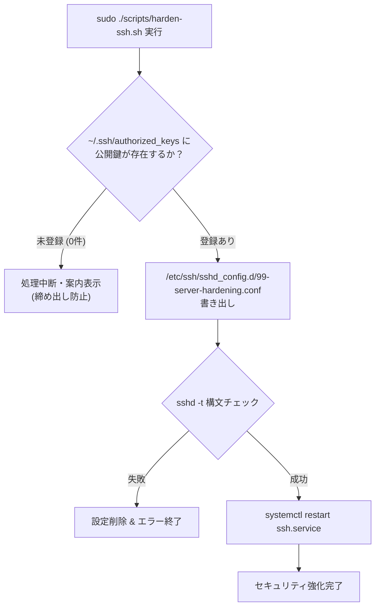

# ADR-0005: SSH セキュリティ強化（公開鍵認証必須化・パスワード認証無効化・sshd_config.d 管理）の採用

## 状態
承認 (Accepted)

## 日付
2026-08-29

## コンテキスト
WSL2 環境において Mirrored ネットワークモード（`networkingMode=mirrored`）を採用したことにより、WSL インスタンスのネットワークスタックが Windows ホストの物理ネットワークインターフェース（LAN IP）と直接同期・バインドされるようになった。

これにより、ポートフォワーディング等の面倒なプロキシ設定なしに外部クライアント端末から SSH 接続が可能となった反面、ローカルネットワーク（または外部環境）に SSH ポート（デフォルト: 22）が直接露出することになる。

初期構築時や検証段階ではパスワード認証によるアクセスを行っていたが、以下の課題・リスクが存在する：
1. **ブルートフォース攻撃・辞書攻撃のリスク**: 辞書攻撃ツール等による不正侵入の危険性。
2. **デフォルトの root ログインの危険性**: root での直接ログインが許可されている場合、権限昇格の標的になりやすい。
3. **設定の非破壊的管理と再現性**: `/etc/ssh/sshd_config` を直接手動編集すると、ディストリビューションのパッケージ更新（`openssh-server` のアップグレード）時に設定ファイルが上書き・競合（コンフリクト）を起こすリスクがある。
4. **Ubuntu 24.04 特有の Socket Activation の競合**: Ubuntu 24.04 では `ssh.socket` が標準化されており、設定リロードやポートリッスンで意図しない動作・競合を起こすリスクがある。
5. **締め出し（Lockout）事故のリスク**: 公開鍵が `~/.ssh/authorized_keys` に登録されていない状態で不用意にパスワード認証を無効化すると、リモートからログイン不能となる。

## 決定事項

以下の原則に基づき、SSH サーバーのセキュリティ強化（Hardening）と自動化スクリプトを標準化する：

### 1. 公開鍵認証の必須化とパスワード認証の完全無効化
- `PubkeyAuthentication yes` を明示し、Ed25519 または RSA 4096bit 等の安全な公開鍵認証のみを許可する。
- `PasswordAuthentication no`, `PermitEmptyPasswords no`, `KbdInteractiveAuthentication no` を設定し、いかなるパスワード入力・インタラクティブ認証も遮断する。
- `PermitRootLogin no` により、root アカウントでの直接 SSH ログインを禁止し、一般ユーザー経由の `sudo` 運用を強制する。

### 2. `/etc/ssh/sshd_config.d/` ドロップイン構成の採用
- メインの設定ファイル `/etc/ssh/sshd_config` は変更せず、`/etc/ssh/sshd_config.d/99-server-hardening.conf` に強化設定を独立配置する。
- プレフィックス `99-` を付与することで、既存のデフォルト設定を確実にオーバーライドする。
- これにより、OS・パッケージ更新時のコンフリクトを完全に排除し、設定の破棄・復元をファイル単体で完結させる。

```
/etc/ssh/
├── sshd_config                # OS デフォルト (Include /etc/ssh/sshd_config.d/*.conf)
└── sshd_config.d/
    └── 99-server-hardening.conf  # 本リポジトリが管理するセキュリティ強化設定
```

### 3. スクリプト (`harden-ssh.sh`) による事前検証と締め出し防止（Lockout Prevention）
- 設定適用前に、対象ユーザーの `~/.ssh/authorized_keys` の存在と登録鍵数（1件以上）を自動検証する。
- 公開鍵が1件も存在しない場合は、誤操作による締め出しを防ぐため処理を中断し、公開鍵登録コマンドを案内する。
- 新規設定の書き出し後、`sshd -t`（構文チェック）を実行し、構文エラーがないことを確認してから `systemctl restart ssh.service` を実行する。



## 影響・結果

### プラスの影響
- **堅牢なセキュリティ基盤**: パスワード総当たり攻撃を根本的に無効化し、公開鍵を持つ認証済みクライアントのみにアクセスを制限。
- **パッケージ更新への耐性**: ドロップイン設定方式により、`apt upgrade` 時の設定衝突・上書きプロンプトを回避。
- **ヒューマンエラー防止**: 自動チェックにより、公開鍵未登録のままパスワード認証を切ってログイン不能になるリスクを排除。

### マイナスの影響 / 留意点
- **クライアント側での事前準備**: 新しいクライアント端末から接続する際は、あらかじめ `ssh-copy-id` または WSL コンソール経由で公開鍵を登録する必要がある。
- **WSL からの緊急アクセス**: 万一公開鍵を紛失した場合でも、Windows ホスト上の `wsl.exe` コマンドからローカルシェルに入り、`authorized_keys` や設定ファイルを修正可能。
