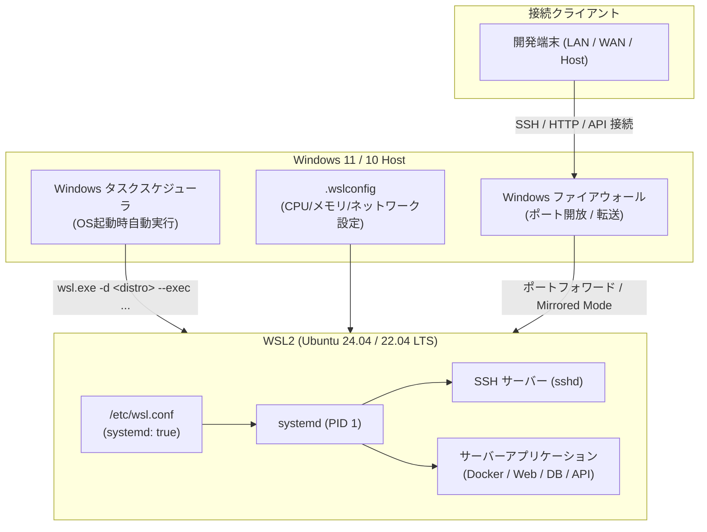

# WSL サーバー構築・運用手順 ディスカッション & 進捗管理 (discussion.md)

このドキュメントでは、Windows 上で WSL2（Ubuntu 等）を用いたサーバー環境を構築し、最終的に「単一の統合手順書（Runbook）」として整備するための要件定義、アーキテクチャ設計、ロードマップ、進捗を記録・管理します。

---

## 目的・ゴール

1. **再現性の高いWSLサーバー環境の構築**:
   - Windows ホスト起動時にバックグラウンドで安定稼働する WSL2 サーバー環境を構築する。
   - systemd の有効化、適切なリソース制御（CPU/メモリ）、SSH 接続、外部ネットワーク連携を実現する。
2. **単一の統合手順書（Runbook）の作成**:
   - ゼロからのセットアップ手順（Windows設定 -> WSL導入 -> Linux基盤設定 -> ネットワーク/自動起動 -> サーバーミドルウェア配置 -> 運用管理）を1つのドキュメントに集約する。
   - コマンドをコピー＆ペーストするだけで確実・迅速に環境を再現できるようにする。

---

## 全体ロードマップ

| Phase | 項目 | 主な内容 | ステータス | 成果物 |
| :--- | :--- | :--- | :--- | :--- |
| **Phase 1** | **要件定義・前提整理** | 構築目的、ディストリビューション選定、ハードウェア要件、ネットワーク要件の確定 | [進行中] | `note/01_requirements_and_architecture.md` |
| **Phase 2** | **WSL2 基盤セットアップ** | Windows機能の有効化、WSL2インストール、`.wslconfig` / `/etc/wsl.conf`（systemd 有効化等）の設定 | [未着手] | `note/02_wsl_base_setup.md` |
| **Phase 3** | **Linux 基本環境 & セキュリティ** | パッケージ更新、ユーザー・sudo設定、SSH鍵認証、UFWファイアウォール設定 | [未着手] | `note/03_linux_hardening_and_ssh.md` |
| **Phase 4** | **ネットワーク & Windows自動起動** | ネットワーク方式選定（Mirrored vs NAT/ポートフォワーディング）、Windows起動時のWSL/サービス自動起動（タスクスケジューラ / systemd） | [未着手] | `note/04_network_and_autostart.md`, `adr/0001-network-mode.md` |
| **Phase 5** | **サーバーミドルウェア構築** | Docker / Podman / Webサーバー / データベース等の配置、ファイルシステム性能配慮（WSL内ext4 vs `/mnt/c`） | [未着手] | `note/05_middleware_and_storage.md` |
| **Phase 6** | **統合手順書 (Runbook) の作成 & 検証** | 各フェーズの手順を集約し、単一のマスター手順書 `SERVER_SETUP_GUIDE.md` として完成・動作検証 | [未着手] | `SERVER_SETUP_GUIDE.md` |

---

## 構築フロー・アーキテクチャ概要

---

## 決定事項 (ADR一覧)

- 未策定（Phase 4 のネットワーク方式・自動起動方式の検証後に策定予定）

---

## 直近のネクストアクション

- [x] Space の作成および初期レイアウトの配置 (`wsl-server`)
- [x] 全体ロードマップおよびアーキテクチャ概要の策定 (`discussion.md`)
- [ ] Phase 1: 構築目的・対象ディストリビューション・用途（Web/Docker/DB等）のヒアリングと要件定義 (`note/01_requirements_and_architecture.md`)
- [ ] Phase 2: WSL2 基本セットアップ手順の検証とメモ作成

