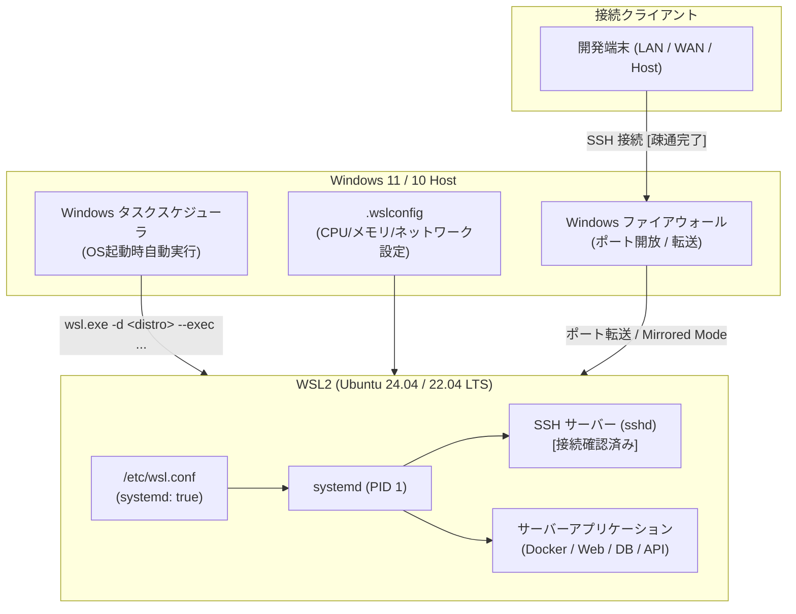

# WSL サーバー構築・運用手順 ディスカッション & 進捗管理 (discussion.md)

このドキュメントでは、Windows 上で WSL2（Ubuntu 等）を用いたサーバー環境を構築し、最終的に「単一の統合手順書（Runbook）」として整備するための要件定義、アーキテクチャ設計、ロードマップ、進捗を記録・管理します。

---

## 目的・ゴール

1. **再現性の高いWSLサーバー環境の構築**:
   - Windows ホスト起動時にバックグラウンドで安定稼働する WSL2 サーバー環境を構築する。
   - systemd の有効化、適切なリソース制御（CPU/メモリ）、SSH 接続、外部ネットワーク連携を実現する。
2. **単一の統合手順書（Runbook）の作成**:
   - ゼロからのセットアップ手順（Windows設定 -> WSL導入 -> Linux基盤設定 -> ネットワーク/自動起動 -> サーバーミドルウェア配置 -> 運用管理）を1つのドキュメントに集約する。
   - コマンドをコピー＆ペーストするだけで確実・迅速に環境を再現できるようにする。

---

## 全体ロードマップ

| Phase | 項目 | 主な内容 | ステータス | 成果物 |
| :--- | :--- | :--- | :--- | :--- |
| **Phase 1** | **要件定義・前提整理** | 構築目的、ディストリビューション選定、ハードウェア要件、ネットワーク要件の確定 | [完了] | `note/01_requirements_and_architecture.md` |
| **Phase 2** | **WSL2 基盤セットアップ** | Windows機能有効化、WSL2インストール、`.wslconfig` / `/etc/wsl.conf` 設定 | [完了] | `note/02_ssh_server_connection_and_current_state.md` |
| **Phase 3** | **Linux 基本環境 & SSH 接続** | パッケージ更新、SSHサーバー起動、Mirrored Mode 接続確立 | [完了] | `note/02_ssh_server_connection_and_current_state.md`, `adr/0001` |
| **Phase 4** | **自動常駐・復旧 (Keep-Alive)** | 内部reboot対応タスクスケジューラ登録、文字コード・エスケープ落とし穴解消 | [確立] | `note/04_troubleshooting_and_lessons_learned.md`, `adr/0002` |
| **Phase 5** | **実機セットアップ & 生ログ記録** | 開発環境、Docker/Podman、ツール導入などの作業ログ逐次蓄積 | [進行中] | `note/03_setup_execution_log.md` |
| **Phase 6** | **統合手順書 (Runbook) の清書 & 検証** | 試行錯誤ログをもとに無駄を削ぎ落とした単一のマスター手順書 `SERVER_SETUP_GUIDE.md` を完成 | [初版作成完了] | `SERVER_SETUP_GUIDE.md` |

---

## 構築フロー・アーキテクチャ概要

---

---

## ドキュメント一覧 (note/ & adr/)

- **調査・仕様・作業ログ (`note/`)**:
  - [`note/01_requirements_and_architecture.md`](note/01_requirements_and_architecture.md): 要件定義と全体アーキテクチャ設計
  - [`note/02_ssh_server_connection_and_current_state.md`](note/02_ssh_server_connection_and_current_state.md): 現状構成シート（Mirrored Mode, Ubuntu 24.04）
  - [`note/03_setup_execution_log.md`](note/03_setup_execution_log.md): 実機セットアップ作業生ログ（トラブル・解決策・コマンド履歴）
  - [`note/04_troubleshooting_and_lessons_learned.md`](note/04_troubleshooting_and_lessons_learned.md): トラブルシューティング知見集・落とし穴マトリクス (全16件)
  - [`note/05_declarative_tool_management.md`](note/05_declarative_tool_management.md): 宣言的パッケージ・ツール管理ツールの選定比較
  - [`note/06_dotfiles_and_git_config_integration.md`](note/06_dotfiles_and_git_config_integration.md): Dotfiles & Git Config 統合パターンの比較
  - [`note/07_server_hardware_and_spec_evaluation.md`](note/07_server_hardware_and_spec_evaluation.md): ハードウェア仕様・カーネル・仮想化サブシステムに基づく性能評価レポート
  - [`note/08_performance_benchmark_results.md`](note/08_performance_benchmark_results.md): GPU (GTX 1650 Ti)・LLM (`llama.cpp`)・ストレージ (ext4 vs 9p) 実機ベンチマーク測定結果レポート
  - [`note/09_gpu_phonetic_service_and_flexible_architecture.md`](note/09_gpu_phonetic_service_and_flexible_architecture.md): 柔軟なGPUサービス基盤（Storage Guard）& 英語カタカナ読み変換API仕様

---

## 決定事項 (ADR一覧)

- [**`ADR-0001: Mirrored ネットワークモードの採用`**](adr/0001-mirrored-network-mode.md) - ポート転送不要・ホストLAN IP直結によるサーバーネットワーク基盤の標準化
- [**`ADR-0002: WSL 常駐化および内部再起動時の自動復旧（Keep-Alive Loop）の採用`**](adr/0002-wsl-keepalive-and-auto-recovery.md) - Ubuntu内部reboot/停止時にも2秒で自動再起動する監視ループタスクの標準化
- [**`ADR-0003: mise による言語ランタイム・CLIツールの宣言的管理の採用`**](adr/0003-declarative-tool-management-with-mise.md) - mise.toml による全開発ツール・ランタイムの一括宣言管理の標準化
- [**`ADR-0004: サプライチェーン攻撃対策としてのバージョン遅延（7-day Cooldown）および Lockfile 検証の採用`**](adr/0004-supply-chain-security-and-version-cooldown.md) - latest禁止・7日経過安定版固定・チェックサム検証の標準化
- [**`ADR-0005: SSH セキュリティ強化（公開鍵認証必須化・パスワード認証無効化・sshd_config.d 管理）の採用`**](adr/0005-ssh-hardening-and-key-authentication.md) - 締め出し防止検証付きパスワード遮断とドロップイン設定による堅牢化の標準化

---

## 直近のネクストアクション（マシン上での引き継ぎ用）

- [x] Ubuntu 24.04 LTS へのアップグレード完了
- [x] Windows タスクスケジューラ常駐化（`setup-autostart.bat`）と `sudo reboot` 自動復旧検証完了
- [x] `mise` による全開発ツール（Node.js, Go, Python, gh, jq, ripgrep 等）の宣言的導入完了
- [x] Antigravity CLI (`agy`) のインストール & Google OAuth 認証完了
- [x] SSH セキュリティの強化（`harden-ssh.sh`）および公開鍵認証必須化完了
- [x] 統合手順書（`SERVER_SETUP_GUIDE.md`）の初版作成完了
- [x] 仕様・実測観測ベースの性能評価レポート（`note/07`）の作成完了
- [x] 実機ベンチマーク（GPU / LLM / ストレージ I/O）の測定完了 (`note/08`)
- [x] **[NEW] 柔軟なGPUサービス基盤（Storage Guard）と英語カタカナ読み変換APIの構築完了 (`note/09`)**:
  - `manage-gpu-service.sh` によるストレージ容量節約（単一モデル維持・fstrim連携）とHot-Swap切り替えの確立
  - Qwen2.5 1.5B (VRAM 1.1GB) による「AKB -> エーケービー」「AWS -> エーダブリューエス」の完全精度変換を実証
  - 自宅 k8s クラスタ向け ExternalName Service 設定マニフェスト整備
- [ ] **[保留] Docker / Docker Compose（コンテナ基盤）のセットアップ**:
  - ユーザー指示により一旦不要として保留（将来必要時に着手）

