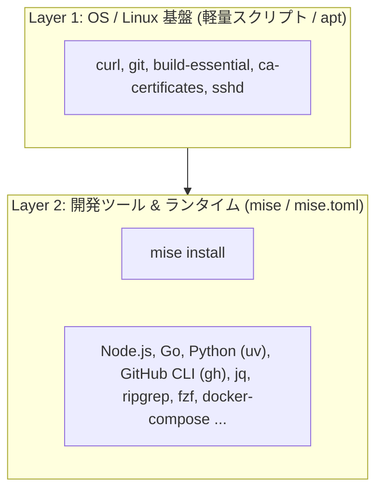

# 宣言的ツール・パッケージ管理ツールの選定比較 (note/05)

## 1. 概要

命令的なコマンド実行（`apt install`, `curl | bash` 等の羅列）ではなく、**「1 つの設定ファイル（YAML / TOML）に必要なツール群を宣言しておき、1 コマンドで望ましい状態を自動収束させる（Declarative Management）」** ためのツール選定と比較まとめです。

---

## 2. 代表的な宣言的ツールの比較

| ツール | 主な管理対象 | 宣言ファイル | メリット | デメリット / 特徴 | おすすめ度 |
| :--- | :--- | :--- | :--- | :--- | :--- |
| **`mise` (旧 rtx)** | 言語ランタイム + CLI ツール全般 | `mise.toml` | Rust 製で超高速。Node/Go/Python から jq/fzf/gh まで 1 ファイルで完全管理。自動 PATH 解決。 | システム全体（systemd 等）の管理は対象外 | **★★★★★ (最有力)** |
| **`aqua`** | GitHub Releases の CLI ツール | `aqua.yaml` | YAML で CLI ツールを厳格バージョン管理。セキュリティ検証（Checksum）が強固。 | 言語ランタイム（Python, Node 等）の細かなビルド管理には非対応 | **★★★★☆ (CLI特化)** |
| **`Ansible`** | OS 設定、apt、systemd、ファイル配置 | `playbook.yml` | サーバー全体の構成管理（apt + 設定ファイル + サービス起動）を完全な冪等性で宣言可能。 | 小規模な開発ツール導入にはやや大掛かり | **★★★★☆ (OS基盤全体)** |
| **`Nix` (Home-Manager)** | パッケージ・ドットファイル・環境全体 | `flake.nix` | 完全な再現性と隔離環境。OS を問わず同一環境を復元可能。 | 学習コストが高く、DSL (Nix言語) の習得が必要 | **★★★☆☆ (玄人向け)** |

---

## 3. WSL サーバー環境におけるベストプラクティス構成

実務において最もクリーンでメンテナンス性が高い構成は、**「OS 基盤（apt / systemd）」と「開発ツール・CLI群」の 2 層分離** です：



### `mise.toml` による宣言的管理の具体例

リポジトリ内に以下の `mise.toml` を 1 つ置いておくだけで、`mise install` 1 コマンドですべてのツールが指定バージョンで揃います：

```toml
[tools]
# 言語ランタイム
node = "lts"
go = "latest"
python = "3.12"
uv = "latest"

# CLI ツール (GitHub Releases / aqua backend から自動取得)
"ubi:cli/cli" = "latest"       # GitHub CLI (gh)
"ubi:jqlang/jq" = "latest"     # jq
"ubi:BurntSushi/ripgrep" = "latest" # rg
"ubi:junegunn/fzf" = "latest"  # fzf
"ubi:eza-community/eza" = "latest" # eza (モダンな ls)
```
