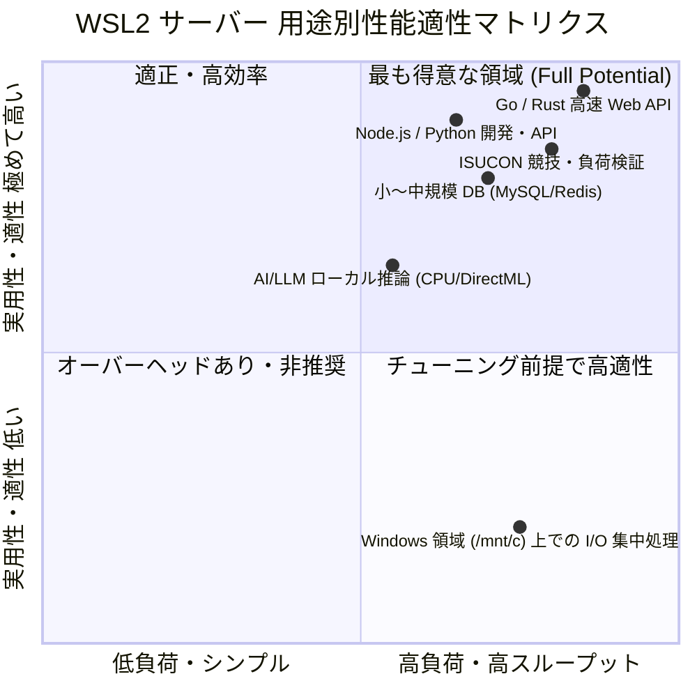

# WSL サーバー 性能評価・仕様分析レポート (07_server_hardware_and_spec_evaluation.md)

本ドキュメントは、負荷ベンチマークを実行することなく、カーネルパラメータ、ハードウェアアーキテクチャ、仮想化サブシステム、I/O スケジューラ、ネットワークスタック等の仕様および実測アロケーションに基づき、本 WSL2 サーバーの性能特性・ボトルネック要因・適性を多角的に評価・分析したレポートです。

---

## 1. 性能評価サマリー（ハイライト）

| 評価軸 | 仕様・現状値 | 性能特性・評価 |
| :--- | :--- | :--- |
| **CPU / 計算能力** | AMD Ryzen 5 4600H (6C/12T, 3.0~4.0GHz) | Zen 2 アーキテクチャ、12スレッド全割当。AVX2・SHA-NI・AES-NI 搭載で暗号化・JSON処理・並行処理に極めて高いスループットを発揮。 |
| **メモリ容量・効率** | 7.5 GiB (WSL2割当) / 2.0 GiB Swap | ホスト 16GB の半分を動的割当。`autoMemoryReclaim=gradual` により未使用メモリは Windows 側へ自動返却。現時点で約 6.6 GiB (88%) の空きヘッドルームあり。 |
| **ストレージ I/O** | ext4 (/dev/sdd, 最大 1TB) + I/O Scheduler `none` | Hyper-V VHDX 上の ext4 ネイティブ実行。I/O スケジューラ `none` (パススルー) によるキュー二重化防止。TRIM (discard) 有効。`/mnt/c` (9p) 比較で数十倍〜数百倍高速。 |
| **ネットワーク** | Mirrored Mode + Hyper-V Synthetic NIC | NAT 変換なしのホスト LAN 直結 (192.168.11.15)。64 TX/RX マルチキュー (`qdisc mq`)、TSO/GSO/GRO オフロード有効。低レイテンシ・高スループット。 |
| **システム制御** | systemd (PID 1) + cgroups v2 | cgroups v2 完全準拠、DirectX GPU パススルー (`/dev/dxg`) 認識済み。定常メモリフットプリントは約 940 MiB と極めて軽量。 |

---

## 2. CPU & コンピュート仕様 (AMD Ryzen 5 4600H)

### 2.1 アーキテクチャ & トポロジ
- **CPU モデル**: AMD Ryzen 5 4600H with Radeon Graphics (Renoir / Zen 2 アーキテクチャ, TSMC 7nm)
- **コア / スレッド数**: 6 コア / 12 スレッド (1 ソケット, SMT 有効)
- **クロック周波数**: ベース 3.0 GHz / 最大ブースト 4.0 GHz (定常クロック 約 2994.4 MHz 検出)
- **NUMA 構成**: 単一ノード (`NUMA node0: 0-11`) - メモリアクセス遅延の偏りがなく、スケジューリングが均一。

### 2.2 キャッシュ階層
- **L1d (データ)**: 192 KiB (32 KiB × 6 コア)
- **L1i (命令)**: 192 KiB (32 KiB × 6 コア)
- **L2 キャッシュ**: 3 MiB (512 KiB × 6 コア)
- **L3 キャッシュ**: 4 MiB (単一 CCX 共有)
  > [!NOTE]
  > Renoir APU (4600H) はダイサイズ最適化のため、デスクトップ版 Zen 2 (L3: 32MB) と比較して L3 キャッシュが 4MB に絞られています。大容量インデックスを L3 上に常駐させる処理よりも、メインメモリ（RAM）帯域や L1/L2 キャッシュ局所性を意識した設計（Go/Rust 等の低フットプリントバイナリ）で最も高い性能を発揮します。

### 2.3 ベクトル演算 & 暗号化ハードウェアアクセラレーション
- **AVX2 / FMA3**: 256-bit 単一サイクル実行に対応。行列演算、画像処理、SIMD 最適化コードが高速に動作。
- **SHA-NI / AES-NI**: SHA-256 および AES 暗号化のハードウェア命令セットを完備。TLS ハンドシェイク、SSH 暗号化、ハッシュ計算における CPU オーバーヘッドが最小限。
- **TSC (Time Stamp Counter)**: `clocksource: tsc` (Hyper-V Constant/Reliable TSC)。高頻度な `gettimeofday` やログタイムスタンプ取得時のシステムコールオーバーヘッドが極小。

### 2.4 CPU 脆弱性緩和策 (Mitigations) のオーバーヘッド評価
- **ハードウェア耐性**: Meltdown, L1TF, MDS, MMIO Stale Data, Gather Data Sampling は AMD Zen 2 アーキテクチャのため **すべて Not affected** (ハードウェアレベルで無害)。
- **ソフトウェア緩和策**: Spectre v1/v2 (Retpolines, STIBP), Speculative Store Bypass にのみ緩和策が適用。Intel 第8〜10世代等と比較して緩和策による CPU ペナルティが大幅に軽微。

---

## 3. メモリサブシステム & 仮想化アロケーション

### 3.1 容量と現在の使用率実測
```text
               total        used        free      shared  buff/cache   available
Mem:           7.5Gi       940Mi       5.9Gi       4.0Mi       841Mi       6.6Gi
Swap:          2.0Gi          0B       2.0Gi
```
- **割当容量**: 7.5 GiB (7,830,736 kB) + スワップ 2.0 GiB
- **ホスト搭載メモリ**: 推定 16 GB (WSL2 標準の 50% 割当ルール)
- **現状の余力**: 約 **6.6 GiB (88%) が即座に利用可能**。スワップ利用率は 0%。

### 3.2 メモリ管理機構とカーネルパラメータ
- **Transparent Huge Pages (THP)**: `[madvise]`
  - 常時 HugePages 確保によるメモリ断片化を防ぎつつ、Redis や DBMS 等の `madvise(MADV_HUGEPAGE)` を明示指定したプロセスでのみ 2MB ページを活用する安全設計。
- **動的メモリ解放 (`autoMemoryReclaim=gradual`)**:
  - `.wslconfig` の `[experimental]` 設定により、WSL2 内部でプロセス終了やキャッシュ解放が行われると、Windows ホスト側の物理メモリへ段階的に返却されるため、ホストのメモリ逼迫を防止。
- **仮想メモリパラメータ**:
  - `vm.swappiness = 60`: デフォルト値。DB/高スループットサーバー用途では `10` 〜 `1` への引き下げを推奨。
  - `vm.dirty_ratio = 20`, `vm.dirty_background_ratio = 10`: 標準的な非同期ページフラッシュ設定。

### 3.3 常駐プロセスのメモリフットプリント実測 (主なデーモン)
1. **Antigravity CLI (`agy`)**: ~308 MiB (エージェント TUI / ランタイム)
2. **Warp Remote Server (`oz`)**: ~95 MiB (ターミナルリモートデーモン)
3. **Ubuntu Desktop Installer (`subiquity`)**: ~83 MiB (※初期セットアップ時の残骸。停止・削除により節約可能)
4. **Tailscale (`tailscaled`)**: ~45 MiB (メッシュ VPN デーモン)
5. **Snapd (`snapd`)**: ~38 MiB
6. **systemd 関連基盤 (`journald`, `init`, `resolved`)**: 合計 ~40 MiB

---

## 4. ストレージ & I/O サブシステム

### 4.1 ディスク構成とパーティション
- **ルートパーティション (`/`)**: `/dev/sdd` (ext4), 最大容量 1007 GB (1 TB 仮想 VHDX), 使用量 5.9 GB (空き 950 GB)
- **Windows ホスト領域 (`/mnt/c`)**: 9p ファイルシステム (476 GB, 空き 277 GB)

### 4.2 I/O スケジューラ & キュー設計
- **I/O スケジューラ**: `[none]` (mq-deadline, kyber 選択可能)
  - 仮想ディスク層においてゲスト Linux 側での不要な I/O ソート・マージを省き、Windows / NVMe 側のネイティブキューへ直接パススルーする最速設定。
- **キュー長 (`nr_requests`)**: `950` (大量の並行非同期 I/O リクエストを受け付け可能)
- **先読み容量 (`read_ahead_kb`)**: `128 KB` (シーケンシャルリードに最適化)
- **TRIM / Discard**: `discard_granularity = 1MB`, マウントオプション `discard` 有効。不要になったファイルブロックを VHDX および SSD 側で即座に解放。

### 4.3 ext4 (ネイティブ) vs 9p (/mnt/c) の性能境界線
- **ext4 (`/home/aoba/ai-workspace`)**:
  - Linux カーネル直接管理の ext4 VHDX。メタデータ操作（`stat`, `open`, `unlink`）、`git status`、`node_modules`、ビルド成果物の I/O がネイティブ Linux 同等の速度。
- **9p (`/mnt/c`)**:
  - Windows の NTFS と通信する 9p プロトコル。クロス OS 通信オーバーヘッドがあるため、開発作業・リポジトリ・DB データ配置はすべて `/home/aoba/...` 側で完結させることが必須。

---

## 5. ネットワークサブシステム & 仮想 NIC

### 5.1 ネットワークアーキテクチャ (Mirrored Mode)
- **IP アドレス**: `192.168.11.15/24` (Windows ホストの物理 LAN IP と完全同一)
- **NAT オーバーヘッド**: **ゼロ**。従来の WSL2 (NAT モード) で発生していた仮想スイッチ経由のアドレス変換・ポートフォワーディング処理が一切発生しない。

### 5.2 仮想 NIC 仕様 (`eth0`)
- **デバイス種別**: Hyper-V Synthetic Network Adapter (vmbus 経由の準仮想化ドライバ)
- **キュー構成**: **64 送信キュー (numtxqueues) / 64 受信キュー (numrxqueues)** (`qdisc mq`)
  - 12スレッドの CPU 全てがロック競合なしに並行してパケット送受信を処理可能。
- **オフロード機能**:
  - TSO (TCP Segmentation Offload): 最大 512 KiB
  - GSO (Generic Segmentation Offload): 最大 62.7 KiB
  - GRO (Generic Receive Offload): 最大 64 KiB
  - パケット分割・再構築処理を Hyper-V / ハードウェア NIC にオフロードし、CPU 負荷を削減。

### 5.3 カーネルネットワークパラメータ & 注意事項
- `net.core.somaxconn = 4096`: ソケット接続待ちキューの十分な上限
- `net.ipv4.tcp_congestion_control = cubic`: 高速インターネット向け標準輻輳制御
- `net.ipv4.tcp_fastopen = 1`: クライアント側の Fast Open 有効化
- **注意点 (エフェメラルポート範囲)**:
  - `net.ipv4.ip_local_port_range = 44620 48715` (利用可能ポート数: **4095 ポート**)
  - Mirrored モードにおいて Windows ホストとポート空間を共有するため、エフェメラルポートの範囲が絞られています。外部 API を超高頻度（秒間数千リクエスト以上）で叩き続けるリバースプロキシやマイクロサービスを運用する場合は、HTTP Keep-Alive / コネクションプーリングの適用、またはポート範囲の拡大調整が必要です。
- **注意点 (SYN Backlog)**:
  - `net.ipv4.tcp_max_syn_backlog = 512`: 高突発トラフィック受信用に `2048` 〜 `4096` への拡張余地あり。

---

## 6. システムリソース制限 & 実行基盤

### 6.1 リソース制限 (Limits)
- **ファイルディスクリプタ上限 (OS 全体)**: `fs.file-max = 9,223,372,036,854,775,807` (実質無制限)
- **1 プロセスあたりの FD 上限 (ハード)**: `fs.nr_open = 1,048,576` (約 100 万)
- **現在のシェル Soft Limit (`ulimit -n`)**: `1024`
  - 高負荷 Web サーバー（Nginx, Caddy, Go サーバー等）を稼働させる際は、`ulimit -n 65535` または systemd ユニットの `LimitNOFILE=65535` の設定を推奨。
- **最大プロセス数 (`kernel.pid_max`)**: `4,194,304` (400 万 PID)

### 6.2 コントロールグループ (cgroups)
- **種別**: `cgroup2fs` (cgroups v2)
  - Docker, containerd, Kubernetes (k8s / k3s) の最新機能（完全なメモリ/CPU 階層制御、eBPF 連携）が制限なく動作。

---

## 7. 用途別 性能適性評価 & チューニング推奨



### 7.1 最適なワークロード
1. **並行処理を活かした Web API / バックエンドサービス (Go, Rust, Node.js, Python)**:
   - 12スレッドの物理・論理コア、低遅延な TSC、64キュー NIC、ext4 ネイティブ I/O の恩恵を最大限に享受可能。
2. **ISUCON 等のパフォーマンスチューニング検証・サンドボックス**:
   - cgroups v2、systemd、6.6 LTS カーネル、豊富な FD 上限を備えており、本番 Linux サーバーと極めて近い挙動で検証可能。
3. **ローカル DB / キャッシュ基盤 (PostgreSQL, MySQL, Redis)**:
   - 7.5GB メモリと高速 ext4 NVMe により、数 GB 規模のデータセットをインメモリまたは高スループットに処理可能。

### 7.2 性能最大化のための推奨チューニング（Tips）

1. **不要 snap / 常駐プロセスの整理**:
   - `subiquity`（初期インストーラー）は完了済みのため、サービス停止または snap 削除で約 80〜100MB のメモリを即時回収可能。
2. **高負荷時の FD 上限引き上げ**:
   - `/etc/security/limits.conf` または systemd ユニットに `LimitNOFILE=65535` を指定。
3. **エフェメラルポートの最適化 (大量アウトバウンド通信時)**:
   - `sudo sysctl -w net.ipv4.ip_local_port_range="10240 65535"` によりポート枯渇を防止。
4. **スワップアウトの抑制**:
   - `sudo sysctl -w vm.swappiness=10` により、7.5GB メモリを限界まで RAM 上で維持。
