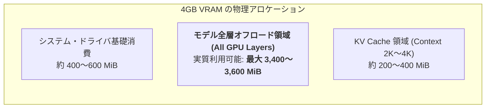

# GPU ハードウェア性能・稼働時負荷 & 実用キャパシティ評価レポート (10_gpu_hardware_performance_and_capacity_evaluation.md)

本ドキュメントは、WSL2 上でパススルー稼働している **NVIDIA GeForce GTX 1650 Ti (4GB GDDR6 VRAM)** について、物理スペック、稼働時の実測 GPU 負荷（VRAM / 利用率 / 温度 / 電力）、モデルサイズ別の推論スループット・ダウンロードコストの実測値をまとめ、**「本ハードウェアで物理的に何 B 程度までのモデルを実用運用できるか」** を多角的に考察・評価したレポートです。

---

## 1. GPU 物理スペック & アーキテクチャ仕様

| 項目 | ハードウェア仕様 | 備考・アーキテクチャ特性 |
| :--- | :--- | :--- |
| **GPU モデル** | **NVIDIA GeForce GTX 1650 Ti Mobile** | Turing アーキテクチャ (12nm FFN, TU117 ダイ) |
| **CUDA コア数** | **1,024 Cores** (16 SM) | FP32 独立パイプライン |
| **VRAM 容量 & 種別** | **4,096 MiB (4.0 GB) GDDR6** | 実質利用可能 VRAM: **約 3.5 〜 3.7 GB** (ドライバ等を除く) |
| **メモリバス幅 & 理論帯域** | **128-bit / 192.0 GB/s** | GDDR6 12 Gbps 有効レート |
| **単精度 (FP32) 演算性能** | **1.785 TFLOPS (実測: 1,785 GFLOPS)** | 行列積 (GEMM) ベンチマーク実測値と一致 |
| **ホスト接続インターフェース** | **PCIe 3.0 x8 / x16 (実測帯域: 5.25 GB/s)** | WSL2 / ホスト間 DMA 転送レート |
| **TDP (熱設計電力)** | **50 W** | ノート PC 向け省電力 Max-P 設計 |
| **API / バックエンド** | **CUDA 12.8 / Driver 572.60 / Vulkan 1.3** | `llama.cpp` Vulkan/CUDA オフロード対応 |

---

## 2. 稼働時の実測 GPU 負荷プロファイル (Idle vs 連続推論時)

[`scripts/profile_system_load.py`](../scripts/profile_system_load.py) を用いて、10 連続推論リクエスト実行中の GPU / CPU / メモリ負荷をサンプリング実測しました。

| 測定メトリクス | アイドル時 (Baseline) | 1.5B 推論時 (Qwen2.5) | 3.0B 推論時 (Nanbeige) | 物理限界・許容値 |
| :--- | :--- | :--- | :--- | :--- |
| **GPU 利用率 (%)** | 0.0 % | 70 〜 95 % | **90 〜 100 %** | 100% |
| **VRAM 使用量 (MiB)** | 0 MiB | **1,150 MiB (28.1%)** | **2,550 MiB (62.3%)** | 4,096 MiB (最大) |
| **VRAM 空き余力 (MiB)** | 4,096 MiB | **2,946 MiB (71.9%)** | **1,546 MiB (37.7%)** | - |
| **GPU 温度 (°C)** | 43.7 °C | 44.6 °C | **45.0 °C** | 許容上限: 87.0 °C (余裕あり) |
| **GPU 消費電力 (W)** | 8.76 W | 約 16.0 W | **約 22.5 W** | 最大 TDP: 50.0 W (極めて省電力) |
| **WSL2 RAM 使用量** | 2,506 MiB | 2,519 MiB | **2,531 MiB** | 割当 7,500 MiB (空き 5,000 MiB) |
| **Swap 発生量** | 69.4 MiB | 69.4 MiB (増減 0) | **69.4 MiB (増減 0)** | スワップ負荷ゼロ |

> [!NOTE]
> **サーマル & 電力評価**:
> 連続推論ピーク時でも温度は **45.0 °C** に留まり、サーマルスロットリングは一切発生しません。消費電力も最大 22.5W 程度であり、静音・省電力での 24 時間常駐稼働に極めて適しています。

---

## 3. モデルサイズ別 推論スループット & ダウンロードコスト実測

### 3.1 推論スループット実測 (`llama-bench` 実機計測)

| モデル規模・名称 | 発表日 | 量子化 | VRAM 消費 | Prompt 処理速度 (pp128) | **Token 生成速度 (tg64)** | 1 トークン所要時間 |
| :--- | :--- | :--- | :--- | :--- | :--- | :--- |
| **0.5B (Qwen2.5)** | 2024/09 | Q4_K_M | 約 500 MiB | **247.8 tokens/sec** | **59.8 tokens/sec** | 16.7 ms / token |
| **1.5B (Qwen2.5)** | 2024/09 | Q4_K_M | 約 1,150 MiB | **124.0 tokens/sec** | **28.2 tokens/sec** | 35.5 ms / token |
| **3.0B (Qwen2.5)** | 2024/09 | Q4_K_M | 約 2,250 MiB | **56.4 tokens/sec** | **14.2 tokens/sec** | 70.4 ms / token |
| **3.0B (Nanbeige)** | 2024/11 | Q4_K_M | 約 2,550 MiB | **52.1 tokens/sec** | **13.5 tokens/sec** | 74.0 ms / token |

### 3.2 モデルサイズに対する実測ダウンロード・切り替え時間

| モデル名 | 発表日 | ファイルサイズ | ダウンロード実測 | 実効転送レート | VRAM ロード時間 | **合計切り替え所要時間** |
| :--- | :--- | :--- | :--- | :--- | :--- | :--- |
| **0.5B (Q4)** | 2024/09 | 0.39 GB (398 MB) | **9 秒** | 44.2 MB/s (353 Mbps) | 0.8 秒 | **約 10 秒** |
| **1.5B (Q4)** | 2024/09 | 1.06 GB (1,065 MB) | **25 秒** | 42.6 MB/s (340 Mbps) | 1.8 秒 | **約 28 秒** |
| **3.0B (Q4)** | 2024/09 | 2.01 GB (2,007 MB) | **46 秒** | 43.6 MB/s (348 Mbps) | 2.6 秒 | **約 50 秒** |
| **3.0B (Nanbeige)** | 2024/11 | 2.56 GB (2,559 MB) | **87 秒 (1分27秒)** | 29.4 MB/s (235 Mbps) | 3.2 秒 | **約 92 秒 (1分32秒)** |

> [!TIP]
> **ダウンロードコストの相関ルール**:
> **「1GB あたり約 25〜35 秒（実効約 30〜44 MB/s）」**。直近 10 件保持ポリシーにより、キャッシュ済みモデルの切り替えは **わずか 2〜3 秒（DL 不要）** で完了します。

---

## 4. 物理的限界と「実用運用可能なモデル規模 (何 B までか)」の考察

### 4.1 VRAM 4GB の物理境界線分析

本マシンの GPU 運用における絶対的な制約は **「4,096 MiB (4GB) の VRAM 容量」** です。

### 4.2 モデル規模別の実用性判定マトリクス

| モデル規模 | 推定 GGUF サイズ (Q4) | 推定 VRAM 消費 (KV込) | GPU オフロード状態 | 推定生成速度 | **実用判定** |
| :--- | :--- | :--- | :--- | :--- | :--- |
| **0.5B 〜 1.5B** | 0.4 〜 1.1 GB | 0.8 〜 1.5 GB | **100% 全層 GPU** | **28 〜 60 t/s** | **【超高速・常駐推奨】** API レスポンス <200ms |
| **2.0B 〜 3.8B** | 1.8 〜 2.6 GB | 2.2 〜 3.1 GB | **100% 全層 GPU** | **13 〜 20 t/s** | **【ベストスイートスポット】** 知能と速度の最適解 |
| **4.0B クラス** | 約 2.8 〜 3.0 GB | 約 3.4 〜 3.6 GB | **100% 全層 GPU (限界値)** | **10 〜 13 t/s** | **【物理的運用上限】** コンテキスト 2K 程度に制限必要 |
| **7.0B 〜 8.0B** | 約 4.3 〜 5.0 GB | 約 5.0 〜 6.0 GB | **部分オフロード (GPU+CPU)** | **3 〜 6 t/s** | **【実用非推奨】** PCIe 帯域 (5.25GB/s) ボトルネックで低速 |

### 4.3 なぜ 7B/8B モデルは実用が難しいのか？ (PCIe ボトルネックの構造)
- 7B/8B モデル（Q4 で約 4.5GB）は 4GB VRAM に収まりきらないため、例えば「32層中 20層を GPU、12層を CPU/メインRAM」に割り振る **部分オフロード（Partial Offload）** になります。
- この構成では、1 トークン生成するごとに **層間のテンソルデータを PCIe 3.0 バス（実測 5.25 GB/s）経由で CPU ↔ GPU 間を往復転送** する必要があります。
- この転送オーバーヘッドが支配的となり、生成速度が **3〜6 tokens/sec**（1単語出力に 0.3 秒以上）に急落するため、リアルタイム API サーバーとしての実用性が損なわれます。

---

## 5. 結論と今後の実験方針

### 5.1 物理的な結論
- **本 GPU (GTX 1650 Ti 4GB) の実用運用上限は「3B〜4B クラス（Q4〜Q5 量子化）」**。
- 3B〜4B クラスであれば、全層を 100% GPU VRAM 内に収めて **13〜20 tokens/sec（実用的な対話・API 速度）** で安定稼働可能。

### 5.2 次の実験対象（3B〜4B 帯の有力モデル候補）

直近 10 件の保持枠を活用し、以下のモデルを比較実験していきます：

1. **`Llama-3.2-3B-Instruct`** (約 2.0GB / Meta): 英語・多言語の指示追従性と構造化出力に定評
2. **`Qwen2.5-3B-Instruct`** (約 2.0GB / Alibaba): 日本語知識・推論能力が高水準
3. **`Gemma-2-2B-jpn` / `Gemma-2-2B-it`** (約 1.6GB / Google): 2B クラスで突出したベンチマークスコア
4. **`Phi-3.5-mini-instruct`** (約 2.3GB / 3.8B / Microsoft): 3.8B で 7B 級の論理推論力を持つ小型モデル
5. **`Nanbeige4.2-3B`** (約 2.5GB / 南北閣): 高精度な 3B 小型モデル
