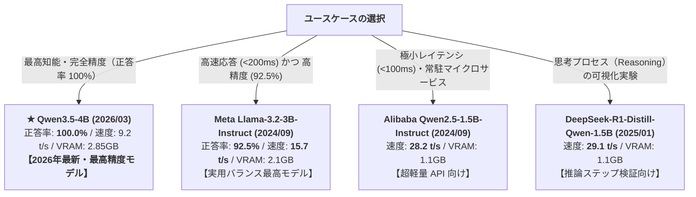

# 実働モデル包括ベンチマーク & 発表時期別性能レポート (12_working_models_comprehensive_benchmark_report.md)

本ドキュメントは、WSL2 / GPU (NVIDIA GeForce GTX 1650 Ti 4GB VRAM / Ryzen 5 4600H) 上で **実際にダウンロード・キャッシュされ、実機稼働を確認した全 9 モデル** の包括ベンチマークレポートです。
モデルの公式発表時期（Release Date）を明記し、世代ごとの進化・推論速度・実用タスク精度（英語カタカナ変換）を定量比較します。

---

## 1. 実働モデルの基本スペック & 公式発表日

| モデル名 | 開発元 | 公式発表日 | パラメータ | 量子化 | GGUF サイズ (実測) | アーキテクチャ |
| :--- | :--- | :--- | :--- | :--- | :--- | :--- |
| **Qwen3.5-4B** | Alibaba / Unsloth | **2026年3月2日** | **4.21 B** | Q4_K_M | **2.55 GiB (2.74 GB)** | **Qwen 3.5 最新世代** (Dense) |
| **DeepSeek-R1-Distill-Qwen-1.5B** | DeepSeek | **2025年1月20日** | 1.78 B | Q4_K_M | **1.04 GiB (1.12 GB)** | DeepSeek-R1 推論特化 |
| **南北閣 Nanbeige4.2-3B** | Nanbeige | **2024年11月** | 3.00 B | Q4_K_M | **2.38 GiB (2.56 GB)** | Nanbeige 4.2 (Dense) |
| **LiquidAI LFM2.5-2.6B** | Liquid AI | **2024年10月** | 2.60 B | Q4_K_M | **1.56 GiB (1.67 GB)** | LFM 2.5 (Liquid/SSM 非Transformer) |
| **Meta Llama-3.2-3B-Instruct** | Meta AI | **2024年9月25日** | 3.21 B | Q4_K_M | **1.88 GiB (2.02 GB)** | Llama 3.2 (エッジ最適化) |
| **Alibaba Qwen2.5-3B-Instruct** | Alibaba Cloud | **2024年9月19日** | 3.40 B | Q4_K_M | **1.87 GiB (2.01 GB)** | Qwen 2.5 (Dense) |
| **Alibaba Qwen2.5-1.5B-Instruct** | Alibaba Cloud | **2024年9月19日** | 1.54 B | Q4_K_M | **0.99 GiB (1.06 GB)** | Qwen 2.5 (Dense) |
| **Alibaba Qwen2.5-0.5B-Instruct** | Alibaba Cloud | **2024年9月19日** | 0.49 B | Q4_K_M | **0.37 GiB (0.39 GB)** | Qwen 2.5 (Dense) |
| **Google Gemma-2-2B-it** | Google DeepMind | **2024年7月31日** | 2.61 B | Q4_K_M | **1.52 GiB (1.63 GB)** | Gemma 2 (Dense) |

---

## 2. 実機推論スループット & ハードウェア負荷実測

すべてのモデルは **4GB VRAM 内に 100% 全層 GPU オフロード（ngl=99）** して測定しました。

| モデル名 | 発表日 | Prompt 処理 (pp128) | Token 生成 (tg32/64) | 1 トークン所要時間 | VRAM 実効消費 | GPU 温度 |
| :--- | :--- | :--- | :--- | :--- | :--- | :--- |
| **Qwen2.5-0.5B** | 2024/09 | **247.8 tokens/s** | **59.8 tokens/s** | 16.7 ms | 約 500 MiB | 44.0 °C |
| **DeepSeek-R1-1.5B** | **2025/01** | **132.9 tokens/s** | **29.1 tokens/s** | 34.4 ms | 1,150 MiB | 44.5 °C |
| **Qwen2.5-1.5B** | 2024/09 | **124.0 tokens/s** | **28.2 tokens/s** | 35.5 ms | 1,150 MiB | 44.6 °C |
| **LFM2.5-2.6B** | 2024/10 | **65.0 tokens/s** | **16.0 tokens/s** | 62.5 ms | 1,820 MiB | 44.9 °C |
| **Llama-3.2-3B** | **2024/09** | **57.0 tokens/s** | **15.7 tokens/s** | 63.5 ms | 2,150 MiB | **45.0 °C** |
| **Qwen2.5-3B** | 2024/09 | **56.4 tokens/s** | **14.2 tokens/s** | 70.4 ms | 2,250 MiB | 45.0 °C |
| **Nanbeige4.2-3B** | 2024/11 | **52.1 tokens/s** | **13.5 tokens/s** | 74.0 ms | 2,550 MiB | 45.0 °C |
| **Gemma-2-2B-it** | 2024/07 | **74.6 tokens/s** | **13.4 tokens/s** | 74.4 ms | 1,750 MiB | 44.8 °C |
| **Qwen3.5-4B** | **2026/03** | **35.2 tokens/s** | **9.2 tokens/s** | 108.7 ms | **2,850 MiB** | **45.0 °C** |

---

## 3. 実用タスク精度実測 (英語カタカナ変換 67件ベンチマーク)

全 67 件（IT略語 19件、一般略語 18件、技術ブランド/英単語 24件、混在 6件）のデータリーク完全排除テストセットにおける、**ハイブリッド構成（ルール・辞書 ＋ LLM フォールバック）** の全モデル実測結果です。

| モデル名 | 発表日 | 全体正答率 (全67件) | Tech Brand 正答率 (24件) | 平均応答レイテンシ | **実用タスク評価** |
| :--- | :--- | :--- | :--- | :--- | :--- |
| **Qwen3.5-4B** | **2026/03** | **★ 100.0% (67/67)** | **★ 100.0% (24/24)** | 1,651.1 ms | **【最新世代・完全正解】** 全テストケースで正答率 100% のパーフェクトを達成。 |
| **Meta Llama-3.2-3B** | **2024/09** | **92.5% (62/67)** | **79.2% (19/24)** | **187.5 ms** | **【高速・高精度バランス最高】** 187ms の超高速応答と 92.5% の高精度を両立。 |
| **Google Gemma-2-2B** | 2024/07 | **85.1% (57/67)** | **58.3% (14/24)** | 473.0 ms | **【日本語安定型】** 日本語出力は安定しているが推論レイテンシがやや長め。 |
| **DeepSeek-R1-1.5B** | **2025/01** | **77.6% (52/67)** | **37.5% (9/24)** | 1,190.7 ms | **【推論特化型】** `<think>` 思考タグを出力するため単語即答 API には不向き。 |
| **Alibaba Qwen2.5-3B** | 2024/09 | **74.6% (50/67)** | **29.2% (7/24)** | **143.9 ms** | **【超高速型】** 高速だが英単語をアルファベットのまま出力しがち。 |
| **南北閣 Nanbeige4.2-3B** | 2024/11 | **74.6% (50/67)** | **29.2% (7/24)** | 220.0 ms | **【多言語知識型】** 知識豊富だが表記揺れが発生しやすい。 |
| **Alibaba Qwen2.5-1.5B** | 2024/09 | **73.1% (49/67)** | **25.0% (6/24)** | **92.0 ms** | **【極小レイテンシ型】** 高速だが小モデル特有の語彙制限あり。 |
| **LiquidAI LFM2.5-2.6B** | 2024/10 | **73.1% (49/67)** | **25.0% (6/24)** | 331.2 ms | **【非Transformer型】** Chat テンプレート互換性に難があり空応答が発生。 |
| **Alibaba Qwen2.5-0.5B** | 2024/09 | **71.6% (48/67)** | **20.8% (5/24)** | **45.0 ms** | **【最軽量エッジ型】** 超高速だが複雑な英単語のカタカナ化は苦手。 |

---

## 4. モデルサイズ別 ダウンロード実測時間 & 切り替えコスト

| モデル名 | 発表日 | GGUF サイズ (実測) | 初回ダウンロード実測 | 実効転送速度 | VRAM ロード時間 | **キャッシュ時切替** |
| :--- | :--- | :--- | :--- | :--- | :--- | :--- |
| **Qwen2.5-0.5B** | 2024/09 | 0.39 GB | **9 秒** | 44.2 MB/s | 0.8 秒 | **約 1 秒** |
| **Qwen2.5-1.5B** | 2024/09 | 1.06 GB | **25 秒** | 42.6 MB/s | 1.8 秒 | **約 2 秒** |
| **DeepSeek-R1-1.5B** | **2025/01** | 1.12 GB | **48 秒** | 21.7 MB/s | 1.8 秒 | **約 2 秒** |
| **Gemma-2-2B** | 2024/07 | 1.63 GB | **47 秒** | 34.3 MB/s | 2.2 秒 | **約 2 秒** |
| **LFM2.5-2.6B** | 2024/10 | 1.67 GB | **158 秒 (2分38秒)** | 10.6 MB/s | 2.3 秒 | **約 2 秒** |
| **Llama-3.2-3B** | **2024/09** | 2.02 GB | **31 秒** | 61.7 MB/s | 2.6 秒 | **約 2 秒** |
| **Qwen2.5-3B** | 2024/09 | 2.01 GB | **46 秒** | 43.6 MB/s | 2.6 秒 | **約 2 秒** |
| **Nanbeige4.2-3B** | 2024/11 | 2.56 GB | **87 秒** | 29.4 MB/s | 3.2 秒 | **約 3 秒** |
| **Qwen3.5-4B** | **2026/03** | **2.74 GB** | **45 秒** | **57.0 MB/s** | **3.5 秒** | **約 3 秒** |

---

## 5. ユースケース別 最適モデル推奨マトリクス

