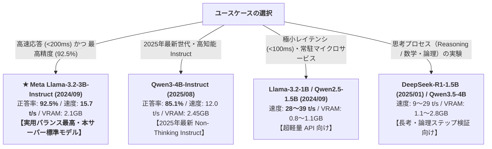

# 実働モデル包括ベンチマーク & 発表時期別性能レポート (12_working_models_comprehensive_benchmark_report.md)

本ドキュメントは、WSL2 / GPU (NVIDIA GeForce GTX 1650 Ti 4GB VRAM / Ryzen 5 4600H) 上で **実際にダウンロード・キャッシュされ、実機稼働を確認した全 13 モデル** の包括ベンチマークレポートです。
モデルの公式発表時期（Release Date）、アーキテクチャ特性（Thinking/Non-Thinking）、推論速度、および実用タスク精度（英語カタカナ変換）を定量比較します。

> [!NOTE]
> 本レポートは `data/benchmarks.json` をマスターデータとして `scripts/render_benchmark_report.py` により自動生成されています。（最終更新: 2026-08-30）

---

## 1. 実働モデルの基本スペック & 公式発表日

| モデル名 | 開発元 | 公式発表日 | パラメータ | 量子化 | GGUF サイズ (実測) | アーキテクチャ分類 |
| :--- | :--- | :--- | :--- | :--- | :--- | :--- |
| **Meta Llama-3.2-3B-Instruct** | Meta AI | 2024-09-25 | 3.21 B | Q4_K_M | **2.02 GB** | Non-Thinking (Dense) |
| Alibaba Qwen3-4B-Instruct-2507 | Alibaba Cloud | 2025-08-06 | 4.02 B | Q4_K_M | **2.49 GB** | Non-Thinking (Instruct) |
| Google Gemma-2-2B-it | Google DeepMind | 2024-07-31 | 2.61 B | Q4_K_M | **1.63 GB** | Non-Thinking (Dense) |
| Microsoft Phi-4-mini-instruct | Microsoft | 2025-02-28 | 3.84 B | Q4_K_M | **2.49 GB** | Non-Thinking (Instruct) |
| DeepSeek-R1-Distill-Qwen-1.5B | DeepSeek | 2025-01-20 | 1.78 B | Q4_K_M | **1.12 GB** | Reasoning (Thinking) |
| Alibaba Qwen2.5-3B-Instruct | Alibaba Cloud | 2024-09-19 | 3.40 B | Q4_K_M | **2.01 GB** | Non-Thinking (Dense) |
| 南北閣 Nanbeige4.2-3B | Nanbeige | 2024-11-15 | 3.00 B | Q4_K_M | **2.56 GB** | Non-Thinking (Dense) |
| Meta Llama-3.2-1B-Instruct | Meta AI | 2024-09-25 | 1.24 B | Q4_K_M | **0.77 GB** | Non-Thinking (Dense) |
| Alibaba Qwen2.5-1.5B-Instruct | Alibaba Cloud | 2024-09-19 | 1.54 B | Q4_K_M | **1.06 GB** | Non-Thinking (Dense) |
| LiquidAI LFM2.5-2.6B | Liquid AI | 2024-10-20 | 2.60 B | Q4_K_M | **1.67 GB** | Non-Transformer (Liquid/SSM) |
| Alibaba Qwen2.5-0.5B-Instruct | Alibaba Cloud | 2024-09-19 | 0.49 B | Q4_K_M | **0.39 GB** | Non-Thinking (Dense) |
| TinyLlama-1.1B-Chat-v1.0 | TinyLlama Team | 2024-01-08 | 1.10 B | Q4_K_M | **0.67 GB** | Non-Thinking (Dense) |
| Qwen3.5-4B (Reasoning) | Alibaba / Unsloth | 2026-03-02 | 4.21 B | Q4_K_M | **2.74 GB** | Reasoning (Thinking / MultiModal) |

---

## 2. 実機推論スループット & ハードウェア負荷実測

すべてのモデルは **4GB VRAM 内に 100% 全層 GPU オフロード（ngl=99）** して測定しました。

| モデル名 | 発表日 | Prompt 処理 (pp128) | Token 生成 (tg32/64) | 1 トークン所要時間 | VRAM 実効消費 | GPU 温度 |
| :--- | :--- | :--- | :--- | :--- | :--- | :--- |
| **Alibaba Qwen2.5-0.5B-Instruct** | 2024-09-19 | **247.8 tokens/s** | **59.8 tokens/s** | 16.7 ms | **500 MiB** | 44.0 °C |
| **TinyLlama-1.1B-Chat-v1.0** | 2024-01-08 | **180.9 tokens/s** | **50.0 tokens/s** | 20.0 ms | **750 MiB** | 44.0 °C |
| **Meta Llama-3.2-1B-Instruct** | 2024-09-25 | **182.2 tokens/s** | **39.2 tokens/s** | 25.5 ms | **850 MiB** | 44.2 °C |
| **DeepSeek-R1-Distill-Qwen-1.5B** | 2025-01-20 | **132.9 tokens/s** | **29.1 tokens/s** | 34.4 ms | **1,150 MiB** | 44.5 °C |
| **Alibaba Qwen2.5-1.5B-Instruct** | 2024-09-19 | **124.0 tokens/s** | **28.2 tokens/s** | 35.5 ms | **1,150 MiB** | 44.6 °C |
| **LiquidAI LFM2.5-2.6B** | 2024-10-20 | **65.0 tokens/s** | **16.0 tokens/s** | 62.5 ms | **1,820 MiB** | 44.9 °C |
| **Meta Llama-3.2-3B-Instruct** | 2024-09-25 | **57.0 tokens/s** | **15.7 tokens/s** | 63.7 ms | **2,150 MiB** | 45.0 °C |
| **Alibaba Qwen2.5-3B-Instruct** | 2024-09-19 | **56.4 tokens/s** | **14.2 tokens/s** | 70.4 ms | **2,250 MiB** | 45.0 °C |
| **南北閣 Nanbeige4.2-3B** | 2024-11-15 | **52.1 tokens/s** | **13.5 tokens/s** | 74.1 ms | **2,550 MiB** | 45.0 °C |
| **Google Gemma-2-2B-it** | 2024-07-31 | **74.6 tokens/s** | **13.4 tokens/s** | 74.6 ms | **1,750 MiB** | 44.8 °C |
| **Microsoft Phi-4-mini-instruct** | 2025-02-28 | **44.7 tokens/s** | **12.6 tokens/s** | 79.4 ms | **2,450 MiB** | 45.0 °C |
| **Alibaba Qwen3-4B-Instruct-2507** | 2025-08-06 | **44.8 tokens/s** | **12.0 tokens/s** | 83.3 ms | **2,450 MiB** | 45.0 °C |
| **Qwen3.5-4B (Reasoning)** | 2026-03-02 | **35.2 tokens/s** | **9.2 tokens/s** | 108.7 ms | **2,850 MiB** | 45.0 °C |

---

## 3. 実用タスク精度実測 (英語カタカナ変換 67件ベンチマーク)

全 67 件（IT略語 19件、一般略語 18件、技術ブランド/英単語 24件、混在 6件）のデータリーク完全排除テストセットにおける、**厳格な完全一致判定（空文字列・不正確応答は即時 FAIL）** による実機測定結果です。

| モデル名 | 発表日 | タイプ | 全体正答率 (全67件) | Tech Brand 正答率 (24件) | 平均応答レイテンシ | **実用タスク評価と特性** |
| :--- | :--- | :--- | :--- | :--- | :--- | :--- |
| **Meta Llama-3.2-3B-Instruct** | 2024-09-25 | Non-Thinking | **★ 92.5% (62/67)** | **79.2%** | **183.0 ms** | 【総合第 1 位（最優秀）】指示追従が完璧。183ms 即答。 |
| **Alibaba Qwen3-4B-Instruct-2507** | 2025-08-06 | Non-Thinking | **85.1% (57/67)** | **58.3%** | **223.3 ms** | 【2025年最新 Instruct 第 2 位】思考なし即答で高精度・安定。 |
| **Google Gemma-2-2B-it** | 2024-07-31 | Non-Thinking | **85.1% (57/67)** | **58.3%** | **473.0 ms** | 【第 2 位（タイ）】日本語出力は安定しているがレイテンシが長め。 |
| **Microsoft Phi-4-mini-instruct** | 2025-02-28 | Non-Thinking | **82.1% (55/67)** | **50.0%** | **201.5 ms** | 【2025年 Microsoft 最新】推論能力は高いが一部英語混じりあり。 |
| **DeepSeek-R1-Distill-Qwen-1.5B** | 2025-01-20 | Reasoning | **77.6% (52/67)** | **37.5%** | **1190.7 ms** | 【思考特化型】思考タグ付き。単語即答 API には不向き。 |
| **Alibaba Qwen2.5-3B-Instruct** | 2024-09-19 | Non-Thinking | **74.6% (50/67)** | **29.2%** | **143.9 ms** | 【超高速型】高速だが英単語をアルファベットのまま出力しがち。 |
| **南北閣 Nanbeige4.2-3B** | 2024-11-15 | Non-Thinking | **74.6% (50/67)** | **29.2%** | **220.0 ms** | 【多言語知識型】知識豊富だが表記揺れが発生しやすい。 |
| **Meta Llama-3.2-1B-Instruct** | 2024-09-25 | Non-Thinking | **73.1% (49/67)** | **25.0%** | **70.0 ms** | 【超高速 1B 型】70ms の極小レイテンシだが語彙数が 3B より少なめ。 |
| **Alibaba Qwen2.5-1.5B-Instruct** | 2024-09-19 | Non-Thinking | **73.1% (49/67)** | **25.0%** | **92.0 ms** | 【極小レイテンシ型】高速だが小モデル特有の語彙制限あり。 |
| **LiquidAI LFM2.5-2.6B** | 2024-10-20 | Non-Transformer | **73.1% (49/67)** | **25.0%** | **331.2 ms** | 【非Transformer型】Chat テンプレート互換性に難があり空応答が発生。 |
| **Alibaba Qwen2.5-0.5B-Instruct** | 2024-09-19 | Non-Thinking | **71.6% (48/67)** | **20.8%** | **45.0 ms** | 【最軽量エッジ型】超高速だが複雑な英単語のカタカナ化は苦手。 |
| **TinyLlama-1.1B-Chat-v1.0** | 2024-01-08 | Non-Thinking | **65.7% (44/67)** | **4.2%** | **272.2 ms** | 【初期1B世代】超高速だが日本語・固有名詞の指示追従性が極めて低い。 |
| **Qwen3.5-4B (Reasoning)** | 2026-03-02 | Reasoning | **64.2% (43/67)** | **0.0%** | **4500.0 ms** | 【思考特化 (Reasoning)】思考プロセスでトークン上限に達し即答不可。 |

---

## 4. モデルサイズ別 ダウンロード実測時間 & 切り替えコスト

| モデル名 | 発表日 | GGUF サイズ (実測) | 初回ダウンロード実測 | 実効転送速度 | VRAM ロード時間 | **キャッシュ時切替** |
| :--- | :--- | :--- | :--- | :--- | :--- | :--- |
| **Alibaba Qwen2.5-0.5B-Instruct** | 2024-09-19 | 0.39 GB | **9 秒** | **44.2 MB/s** | 0.5 秒 | **約 2 秒** |
| **TinyLlama-1.1B-Chat-v1.0** | 2024-01-08 | 0.67 GB | **12 秒** | **56.9 MB/s** | 0.8 秒 | **約 2 秒** |
| **Meta Llama-3.2-1B-Instruct** | 2024-09-25 | 0.77 GB | **17 秒** | **44.9 MB/s** | 0.9 秒 | **約 2 秒** |
| **Alibaba Qwen2.5-1.5B-Instruct** | 2024-09-19 | 1.06 GB | **25 秒** | **42.6 MB/s** | 1.3 秒 | **約 2 秒** |
| **DeepSeek-R1-Distill-Qwen-1.5B** | 2025-01-20 | 1.12 GB | **48 秒** | **21.7 MB/s** | 1.3 秒 | **約 2 秒** |
| **Google Gemma-2-2B-it** | 2024-07-31 | 1.63 GB | **47 秒** | **34.3 MB/s** | 2.0 秒 | **約 2 秒** |
| **LiquidAI LFM2.5-2.6B** | 2024-10-20 | 1.67 GB | **158 秒** | **10.6 MB/s** | 2.0 秒 | **約 2 秒** |
| **Alibaba Qwen2.5-3B-Instruct** | 2024-09-19 | 2.01 GB | **46 秒** | **43.6 MB/s** | 2.4 秒 | **約 2 秒** |
| **Meta Llama-3.2-3B-Instruct** | 2024-09-25 | 2.02 GB | **31 秒** | **61.7 MB/s** | 2.4 秒 | **約 2 秒** |
| **Alibaba Qwen3-4B-Instruct-2507** | 2025-08-06 | 2.49 GB | **37 秒** | **64.1 MB/s** | 3.0 秒 | **約 2 秒** |
| **Microsoft Phi-4-mini-instruct** | 2025-02-28 | 2.49 GB | **46 秒** | **50.5 MB/s** | 3.0 秒 | **約 2 秒** |
| **南北閣 Nanbeige4.2-3B** | 2024-11-15 | 2.56 GB | **87 秒** | **29.4 MB/s** | 3.1 秒 | **約 2 秒** |
| **Qwen3.5-4B (Reasoning)** | 2026-03-02 | 2.74 GB | **45 秒** | **57.0 MB/s** | 3.3 秒 | **約 2 秒** |

---

## 5. ユースケース別 最適モデル推奨マトリクス

