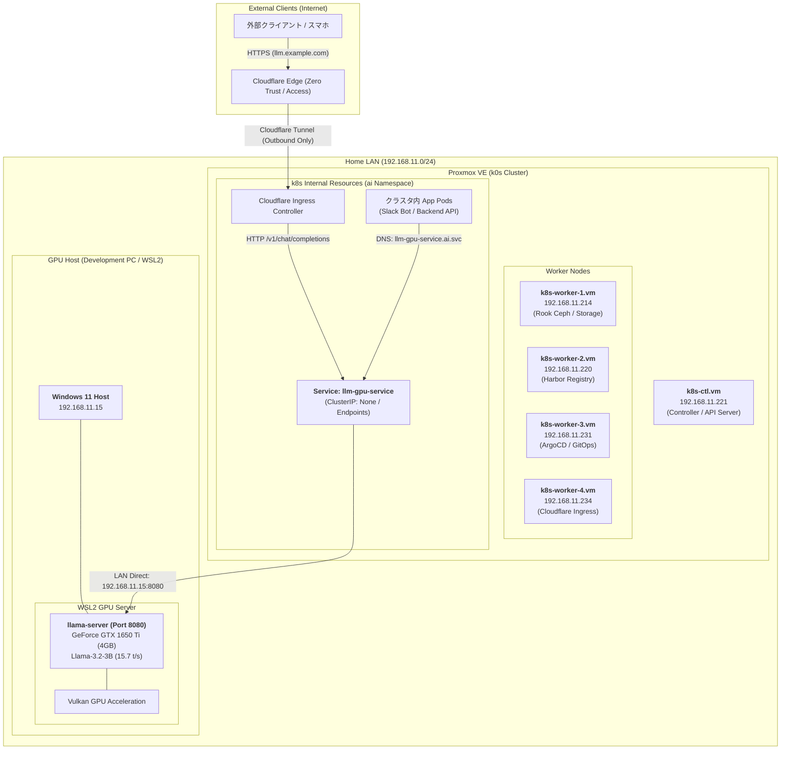
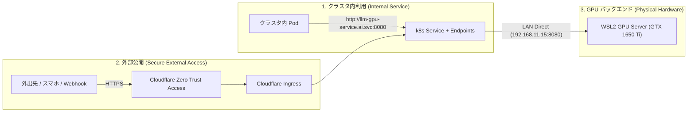

# 自宅 k0s クラスタへの GPU 資源統合 & ネットワーク公開アーキテクチャ設計書 (14_homelab_cluster_gpu_resource_integration_architecture.md)

本ドキュメントは、WSL2 / GPU (NVIDIA GeForce GTX 1650 Ti / IP: `192.168.11.15`) 上で稼働するローカル LLM 推論基盤（`llama-server` / `Meta Llama-3.2-3B-Instruct`）を、Proxmox 上の自宅 Kubernetes クラスタ（**k0s クラスタ**）へ安全かつ宣言的に統合・公開するためのネットワーク構成図およびアーキテクチャ設計書です。

---

## 1. 全体ネットワーク構成図 (Topology Architecture)

自宅 LAN（`192.168.11.0/24`）内の Proxmox VE 上に展開された **k0s クラスタ（1 Controller + 4 Workers）** と、開発機（Windows 11 / WSL2 GPU ホスト）の物理・論理ネットワーク連携構成です。



---

## 2. インフラ・ノード構成仕様（k0sctl.yml 準拠）

`~/k8s-cluster/k0s/k0sctl.yml` に定義されているクラスタノードと、GPU サーバーの仕様一覧です。

| ホスト名 / ノード名 | IP アドレス | 役割 / コンポーネント | インフラ層 | 担当ワークロード |
| :--- | :--- | :--- | :--- | :--- |
| **WSL2 GPU Server** | **`192.168.11.15`** | **LLM 推論基盤 (Port 8080)** | 物理マシン (Windows/WSL2) | **GeForce GTX 1650 Ti / Llama-3.2-3B** |
| **k8s-ctl.vm** | `192.168.11.221` | k0s Controller | Proxmox VM | Kubernetes API Server, etcd, Calico |
| **k8s-worker-1.vm** | `192.168.11.214` | k0s Worker 1 | Proxmox VM | Rook Ceph OSD, 分散永続ストレージ |
| **k8s-worker-2.vm** | `192.168.11.220` | k0s Worker 2 | Proxmox VM | Harbor (プライベート Docker レジストリ) |
| **k8s-worker-3.vm** | `192.168.11.231` | k0s Worker 3 | Proxmox VM | ArgoCD (GitOps 継続的デプロイ) |
| **k8s-worker-4.vm** | `192.168.11.234` | k0s Worker 4 | Proxmox VM | Cloudflare Tunnel Ingress Controller |

- **クラスタネットワーク CNI**: Calico (VXLAN mode, Port: 4789, MTU: 1450)
- **Pod セキュリティ**: Pod Security Standards (Restricted)
- **ストレージ基盤**: Rook Ceph (分散ブロックストレージ / CephFS)

---

## 3. GPU 資源の Kubernetes 統合方式（Integration Patterns）

クラスタ外にある物理 GPU マシン（`192.168.11.15:8080`）を、Kubernetes のネイティブなリソースとして透過的に利用するための **3 つの統合レイヤー** を設計します。



### 方式 1: Selector なし Service ＋ EndpointSlice によるクラスタ内公開（推奨）

Kubernetes の標準機能である「Selector を持たない Service」と「外部 IP を指す Endpoints / EndpointSlice」を作成します。

- **メリット**:
  - クラスタ内の全 Pod（Slack Bot, Web アプリ, バッチ処理等）から `http://llm-gpu-service.ai.svc.cluster.local:8080` でアクセス可能。
  - 将来 GPU サーバーの IP が変更された場合や、複数台の GPU サーバーでロードバランスする場合も、Kubernetes マニフェスト側の変更のみで完結（Pod 側の環境変数変更不要）。
  - kube-proxy や CoreDNS の標準的な負荷分散・ヘルスチェック機構を活用可能。

### 方式 2: Cloudflare Tunnel Ingress による安全な外部公開

すでに `k8s-cluster` に導入されている `cloudflare-tunnel-ingress-controller` を利用し、Ingress マニフェストを 1枚追加するだけで外部公開します。

- **メリット**:
  - 自宅ルーターのポート開放（Port Forwarding）が一切不要（Outbound のみのセキュアなトンネル）。
  - **Cloudflare Zero Trust (Access)** による強力な認証（Google / GitHub ログイン、メールワンタイムパスコード）を前段に挟むことで、自分専用のプライベート AI エンドポイントとして安全に運用可能。
  - SSL/TLS 証明書管理（Let's Encrypt / cert-manager）が自動化。

### 方式 3: ArgoCD による GitOps 宣言的管理

上記のマニフェスト群を `~/k8s-cluster` リポジトリで管理し、ArgoCD の Application として自動同期します。

---

## 4. 宣言的マニフェスト定義（Declarative Manifests）

### 4.1. Namespace & Service & Endpoints 定義 (`llm-gpu-service.yaml`)

```yaml
apiVersion: v1
kind: Namespace
metadata:
  name: ai
  labels:
    pod-security.kubernetes.io/enforce: restricted
---
apiVersion: v1
kind: Service
metadata:
  name: llm-gpu-service
  namespace: ai
  labels:
    app.kubernetes.io/name: llm-gpu-service
    app.kubernetes.io/part-of: ai-infrastructure
spec:
  ports:
    - name: http-openai-api
      port: 8080
      targetPort: 8080
      protocol: TCP
---
apiVersion: discovery.k8s.io/v1
kind: EndpointSlice
metadata:
  name: llm-gpu-service-endpoint
  namespace: ai
  labels:
    kubernetes.io/service-name: llm-gpu-service
addressType: IPv4
ports:
  - name: http-openai-api
    port: 8080
    protocol: TCP
endpoints:
  - addresses:
      - "192.168.11.15"  # WSL2 GPU Host IP
    conditions:
      ready: true
```

---

### 4.2. Cloudflare Ingress 定義 (`llm-ingress.yaml`)

```yaml
apiVersion: networking.k8s.io/v1
kind: Ingress
metadata:
  name: llm-gpu-ingress
  namespace: ai
  annotations:
    cloudflare-tunnel-ingress-controller.strrl.dev/backend-protocol: "http"
    cloudflare-tunnel-ingress-controller.strrl.dev/tunnel-name: "cf-tunnel-ingress-controller"
spec:
  ingressClassName: cloudflare-tunnel
  rules:
    - host: llm.example.com  # あなたのドメイン
      http:
        paths:
          - path: /
            pathType: Prefix
            backend:
              service:
                name: llm-gpu-service
                port:
                  number: 8080
```

---

### 4.3. ArgoCD Application 定義 (`argocd-app-ai-infrastructure.yaml`)

```yaml
apiVersion: argoproj.io/v1alpha1
kind: Application
metadata:
  name: ai-infrastructure
  namespace: argocd
  finalizers:
    - resources-finalizer.argocd.argoproj.io
spec:
  project: default
  source:
    repoURL: https://github.com/AobaIwaki123/k8s-cluster.git
    targetRevision: HEAD
    path: apps/ai-infrastructure
  destination:
    server: https://kubernetes.default.svc
    namespace: ai
  syncPolicy:
    automated:
      prune: true
      selfHeal: true
    syncOptions:
      - CreateNamespace=true
```

---

## 5. クラスタ内アプリケーションからの利用例 (Usage Examples)

クラスタ内にデプロイされた任意の Pod からは、標準的な OpenAI Python SDK や HTTP リクエストで即座に呼び出すことができます。

### Python (OpenAI SDK) での接続例

```python
import os
from openai import OpenAI

# Kubernetes クラスタ内 DNS エンドポイント
client = OpenAI(
    base_url="http://llm-gpu-service.ai.svc.cluster.local:8080/v1",
    api_key="not-needed-for-local"
)

response = client.chat.completions.create(
    model="default-llm",
    messages=[
        {"role": "system", "content": "あなたは親切なアシスタントです。"},
        {"role": "user", "content": "Kubernetesクラスタからこんにちは！"}
    ],
    temperature=0.7
)

print(response.choices[0].message.content)
```

---

## 6. セキュリティ・認証・可観測性の設計方針

1. **アクセス制御 (Zero Trust Access)**:
   - 外部公開時は Cloudflare Access により、指定した GitHub アカウント / メールアドレスのみに制限。
   - クラスタ内アクセスは Calico NetworkPolicy により、許可された Namespace（例: `apps`, `bots`）からのみ `ai` Namespace の `llm-gpu-service` への通信を許可。
2. **GPU サーバーの安定性 & 可観測性 (Observability)**:
   - `llama-server` は `/metrics` (Prometheus 形式) をサポートしているため、クラスタ内の Prometheus Operator (kube-prometheus-stack) でスクレイピングし、Grafana ダッシュボードで **GPU 推論レイテンシ、トークン生成速度 (t/s)、アクティブスロット数** を常時監視可能。
3. **WSL2 マシンの省電力 & 起動連動**:
   - PC 起動時に `manage-gpu-service.sh` がバックグラウンド起動し、常にクラスタからのリクエストを待機。

---

## 7. 実装・適用ロードマップ

- [x] **Step 1 (完了)**: WSL2 上での `llama-server` 安定稼働・Vulkan GPU オフロード最適化・包括ベンチマーク完了。
- [ ] **Step 2**: `~/k8s-cluster` リポジトリに `apps/ai-infrastructure/` ディレクトリを作成し、Service / EndpointSlice / Ingress マニフェストを追加。
- [ ] **Step 3**: ArgoCD で `ai-infrastructure` アプリケーションを同期し、クラスタ内 Service の疎通確認（`curl http://llm-gpu-service.ai.svc:8080/health`）。
- [ ] **Step 4**: Cloudflare Ingress 経由での外部接続テスト（スマホ / 外部ブラウザからのアクセス確認）。
- [ ] **Step 5**: Prometheus / Grafana による推論メトリクス監視の接続。
