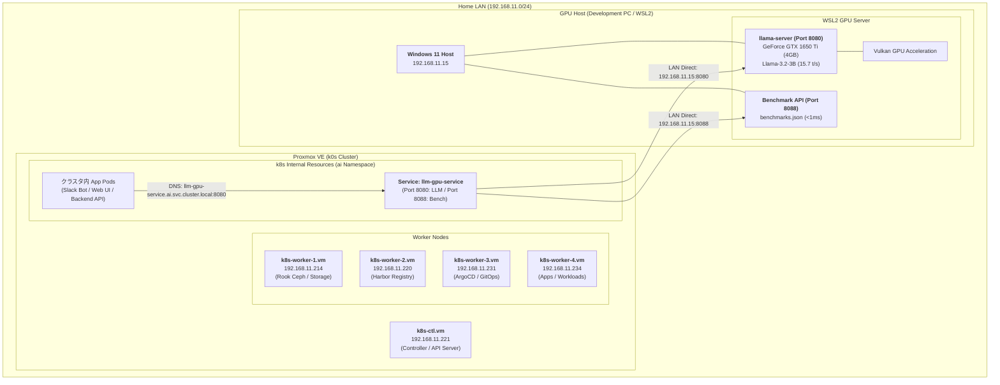

# 自宅 k0s クラスタへの GPU 資源統合 & クラスタ内公開アーキテクチャ設計書 (14_homelab_cluster_gpu_resource_integration_architecture.md)

本ドキュメントは、WSL2 / GPU (NVIDIA GeForce GTX 1650 Ti / IP: `192.168.11.15`) 上で稼働するローカル LLM 推論基盤（`llama-server` / `Meta Llama-3.2-3B-Instruct`）を、Proxmox 上の自宅 Kubernetes クラスタ（**k0s クラスタ**）へ安全かつ宣言的に統合するためのネットワーク構成図およびアーキテクチャ設計書です。

---

## 1. 全体ネットワーク構成図 (Topology Architecture)

自宅 LAN（`192.168.11.0/24`）内の Proxmox VE 上に展開された **k0s クラスタ（1 Controller + 4 Workers）** と、開発機（Windows 11 / WSL2 GPU ホスト）の物理・論理ネットワーク連携構成です。
セキュリティとリソース保護のため、外部 Ingress は設けず、**クラスタ内専用（Internal-Only）** の推論基盤として設計されています。



---

## 2. インフラ・ノード構成仕様（k0sctl.yml 準拠）

`~/k8s-cluster/k0s/k0sctl.yml` に定義されているクラスタノードと、GPU サーバーの仕様一覧です。

| ホスト名 / ノード名 | IP アドレス | 役割 / コンポーネント | インフラ層 | 担当ワークロード |
| :--- | :--- | :--- | :--- | :--- |
| **WSL2 GPU Server** | **`192.168.11.15`** | **LLM 推論 & メタデータ API** | 物理マシン (Windows/WSL2) | **GTX 1650 Ti / Llama-3.2-3B (8080) / Benchmarks (8088)** |
| **k8s-ctl.vm** | `192.168.11.221` | k0s Controller | Proxmox VM | Kubernetes API Server, etcd, Calico |
| **k8s-worker-1.vm** | `192.168.11.214` | k0s Worker 1 | Proxmox VM | Rook Ceph OSD, 分散永続ストレージ |
| **k8s-worker-2.vm** | `192.168.11.220` | k0s Worker 2 | Proxmox VM | Harbor (プライベート Docker レジストリ) |
| **k8s-worker-3.vm** | `192.168.11.231` | k0s Worker 3 | Proxmox VM | ArgoCD (GitOps 継続的デプロイ) |
| **k8s-worker-4.vm** | `192.168.11.234` | k0s Worker 4 | Proxmox VM | 一般アプリケーション / ワークロード実行 |

- **クラスタネットワーク CNI**: Calico (VXLAN mode, Port: 4789, MTU: 1450)
- **Pod セキュリティ**: Pod Security Standards (Restricted)
- **ストレージ基盤**: Rook Ceph (分散ブロックストレージ / CephFS)

---

## 3. なぜ Ingress を設けず「クラスタ内専用（Internal-Only）」とするのか？

1. **GPU リソースの枯渇（DoS）防止**:
   - GTX 1650 Ti（4GB VRAM）の同時推論スロット数は 2〜4 です。外部公開による想定外のトラフィック集中やクローラーによる GPU 占有を完全に防止します。
2. **上位アプリ（Web UI / Bot）による安全な仲介**:
   - 外出先から利用する場合も、推論 API そのものを晒すのではなく、クラスタ内にデプロイした Open WebUI や Slack Bot 側で認証・認可を行って安全にアクセスします。
3. **極小のマニフェスト構成（KISS 原則）**:
   - Ingress、TLS 証明書、ドメインルーティングの管理が不要となり、`Namespace` と `Service` (EndpointSlice) の実質 2 枚（約 40 行）のみで堅牢に運用できます。

---

## 4. 宣言的マニフェスト定義（Declarative Manifests）

### 4.1. Namespace & Service & Endpoints 定義 (`manifests/service.yaml`)

```yaml
apiVersion: v1
kind: Namespace
metadata:
  name: ai
  labels:
    pod-security.kubernetes.io/enforce: restricted
    pod-security.kubernetes.io/audit: restricted
    pod-security.kubernetes.io/warn: restricted
---
apiVersion: v1
kind: Service
metadata:
  name: llm-gpu-service
  namespace: ai
  labels:
    app.kubernetes.io/name: llm-gpu-service
    app.kubernetes.io/part-of: ai-infrastructure
spec:
  ports:
    - name: http-openai-api
      port: 8080
      targetPort: 8080
      protocol: TCP
    - name: http-benchmarks
      port: 8088
      targetPort: 8088
      protocol: TCP
---
apiVersion: discovery.k8s.io/v1
kind: EndpointSlice
metadata:
  name: llm-gpu-service-endpoint
  namespace: ai
  labels:
    kubernetes.io/service-name: llm-gpu-service
addressType: IPv4
ports:
  - name: http-openai-api
    port: 8080
    protocol: TCP
  - name: http-benchmarks
    port: 8088
    protocol: TCP
endpoints:
  - addresses:
      - "192.168.11.15"  # WSL2 GPU Host LAN IP
    conditions:
      ready: true
```

---

### 4.2. ArgoCD Application 定義 (`argocd/llm-gpu-service.app.yaml`)

```yaml
apiVersion: argoproj.io/v1alpha1
kind: Application
metadata:
  name: llm-gpu-service
  namespace: argocd
  finalizers:
    - resources-finalizer.argocd.argoproj.io
spec:
  project: default
  source:
    repoURL: https://github.com/AobaIwaki123/k8s-cluster.git
    targetRevision: HEAD
    path: guide/6-llm-gpu-service/manifests
  destination:
    server: https://kubernetes.default.svc
    namespace: ai
  syncPolicy:
    automated:
      prune: true
      selfHeal: true
    syncOptions:
      - CreateNamespace=true
```

---

## 5. クラスタ内アプリケーションからの利用例 (Usage Examples)

クラスタ内にデプロイされた任意の Pod からは、標準的な OpenAI Python SDK や HTTP リクエストで即座に呼び出すことができます。

### Python (OpenAI SDK) での接続例

```python
import os
from openai import OpenAI

# Kubernetes クラスタ内 DNS エンドポイント
client = OpenAI(
    base_url="http://llm-gpu-service.ai.svc.cluster.local:8080/v1",
    api_key="not-needed-for-local"
)

response = client.chat.completions.create(
    model="default-llm",
    messages=[
        {"role": "system", "content": "あなたは親切なアシスタントです。"},
        {"role": "user", "content": "Kubernetesクラスタからこんにちは！"}
    ],
    temperature=0.7
)

print(response.choices[0].message.content)
```

---

## 6. 実装・適用ロードマップ

- [x] **Step 1**: WSL2 上での `llama-server` 安定稼働・Vulkan GPU オフロード最適化・包括ベンチマーク完了。
- [x] **Step 2**: `model-benchmark` スキルによる事前スペック判定 & 全自動評価パイプラインの構築。
- [x] **Step 3**: Benchmark JSON API (`GET /api/benchmarks` / Port 8088) の実装。
- [x] **Step 4**: `~/k8s-cluster` リポジトリ（`guide/6-llm-gpu-service/`）にクラスタ内専用 Service / EndpointSlice / ArgoCD マニフェストを作成。
- [ ] **Step 5**: ArgoCD による同期と、クラスタ内 Pod からの疎通確認テスト。
